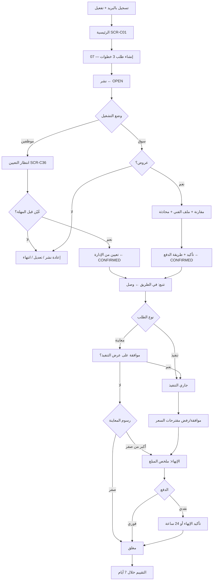

# 05 — رحلة العميل

المخطط والمراحل أدناه تصف **وضع السوق**. في المرحلة الأولى (وضع الموظفين) تُستبدل المرحلتان 5 و6 بانتظار تعيين فني، والمعاينة مجانية (39).

## المراحل
| # | المرحلة | الشاشة | الإجراءات | المرجع |
|---|---|---|---|---|
| 1 | التسجيل | SCR-C10..C13 | إنشاء حساب (اسم، بريد، هاتف، كلمة مرور)، تفعيل البريد، دخول، استعادة | BR-001، BR-002 |
| 2 | الرئيسية | SCR-C01 | اطلب خدمة، اختيار فئة مباشرة، متابعة الطلبات الحالية | DEC-034 |
| 3 | العناوين | SCR-C14، C15 | إضافة عنوان (خريطة + منطقة + تفاصيل)، تعيين افتراضي، حذف | 20 |
| 4 | إنشاء الطلب | SCR-C03..C05 | الخطوات الثلاث، الموافقة على الشروط، النشر | 07 |
| 5 | انتظار العروض *(سوق)* | SCR-C06 | عداد العروض، الترتيب، محادثة، ملف الفني، تعديل (قبل أول عرض)، إلغاء | 09، BR-021 |
| 5أ | انتظار التعيين *(موظفين)* | SCR-C36 | متابعة، تعديل الطلب، إلغاء | 39، BR-007 |
| 6 | الاختيار *(سوق)* | SCR-C08 | مراجعة العرض، اختيار نقدي/إلكتروني، تأكيد | BR-034 |
| 6أ | التعيين *(موظفين)* | إشعار NTF-29 ← SCR-C09 | لا إجراء من العميل؛ طريقة الدفع تُختار عند الإنهاء | T-27، BR-050 |
| 7 | التتبع | SCR-C09 | خريطة، وقت وصول، اتصال، محادثة، مشاركة الزيارة، إلغاء (حتى "في الطريق") | DEC-030، DEC-037 |
| 8 | الزيارة | SCR-C09 (حالات وصل/تنفيذ) | موافقة على عرض التنفيذ أو المقترحات، فتح مشكلة | 11، 12 |
| 9 | الدفع | SCR-C21، C22 | ملخص المبلغ، دفع فوري أو انتظار تأكيد النقدي | 19 |
| 10 | التأكيد | SCR-C23 | تأكيد الإنهاء أو فتح مشكلة | 14 |
| 11 | التقييم | SCR-C24 | 3 أبعاد + نص | BR-090 |
| 12 | السجل | SCR-C25، C26 | الطلبات الحالية والسابقة، التفاصيل، الإيصال | — |
| 13 | الدعم | SCR-C27..C29 | فتح مشكلة، بلاغ عن فني، المساعدة | 16 |

> في وضع الموظفين طريقة الدفع لا تُختار عند التأكيد (لا يوجد تأكيد من العميل)؛ تُختار في شاشة الدفع ويمكن تبديلها حتى السداد (BR-050).

## ما يُمنع على العميل
- الإلغاء بعد وصول الفني (BR-070).
- رؤية رقم الفني قبل التأكيد (BR-101).
- التعديل بعد وصول أول عرض (BR-021).
- أكثر من 3 طلبات مفتوحة (BR-019).
