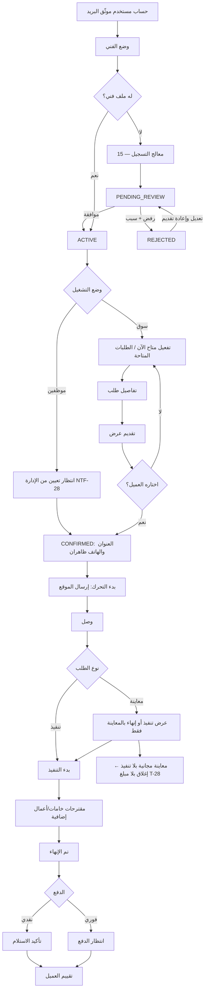

# 06 — رحلة الفني

المخطط أدناه يصف **وضع السوق**. في المرحلة الأولى مقدم الخدمة موظف: لا يقدم عروضًا، ويستقبل طلبًا معيَّنًا من مدير التشغيل (NTF-28) فيبدأ من خطوة "CONFIRMED" مباشرة (39).

## المراحل
| # | المرحلة | الشاشة | الإجراءات |
|---|---|---|---|
| 1 | التحول للوضع | SCR-P01 | زر "وضع الفني" في القائمة الجانبية |
| 2 | التسجيل | SCR-P02..P06 | بيانات، هوية، فئات، مناطق، استلام المستحقات |
| 3 | انتظار المراجعة | SCR-P07 | حالة المراجعة، سبب الرفض، إعادة التقديم |
| 4 | الرئيسية | SCR-P08 | مفتاح "متاح الآن" في الوضعين، الطلب النشط، والطلبات المتاحة في السوق فقط، وتنبيه المستحقات |
| 5 | تقديم العرض *(سوق)* | SCR-P09، P10 | تفاصيل الطلب، نموذج العرض، "صافي لك" بعد العمولة |
| 5أ | استقبال تعيين *(موظفين)* | SCR-P08 | إشعار NTF-28، فتح الطلب المعيَّن مباشرة |
| 6 | عروضي *(سوق)* | SCR-P11 | الحالات، سحب العرض |
| 7 | تنفيذ الطلب | SCR-P12..P16 | تحرك، وصول، بدء، مقترحات، إنهاء، استلام نقدي، تعذّر، عميل غير موجود. في SCR-P14 بوضع الموظفين يظهر نطاق المصنعية، والخروج عنه يتطلب سببًا (BR-046) |
| 8 | التقييم | SCR-P17 | نجوم للعميل |
| 9 | المستحقات | SCR-P18 | الرصيد، العمولات، التحويلات، السداد — وفي وضع الموظفين: المطلوب توريده وقيمة الخامات المردودة (BR-065) |
| 10 | الملف | SCR-P19 | نبذة، خبرة، تخصصات، مناطق، معرض أعمال |

## قيود
- لا يقدم على طلبه هو (BR-022).
- طلب `NOW` نشط واحد فقط، ولا فترات مجدولة متداخلة (BR-034).
- لا يعدّل عرضًا؛ يسحبه ويعيد التقديم مرة واحدة (BR-030).
- لا يستطيع بدء التحرك بدون صلاحية الموقع (EC-21).
- الممنوع بسبب المستحقات يرى طلباته النشطة فقط ورسالة السداد (BR-063) — لا يُطبق في وضع الموظفين.
- في وضع الموظفين: لا يقدم عرضًا ولا يختار طلبًا، ولا يرفض التعيين إلا بالاعتذار كما بعد التأكيد (T-06/07، ثم إعادة تعيين T-29).
- في وضع الموظفين: لا ورديات في النظام؛ لا يظهر الموظف في قائمة SCR-A15 إلا وهو «متاح الآن» (DEC-057).
