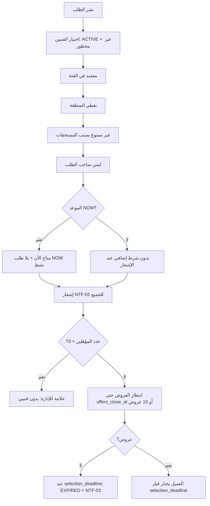
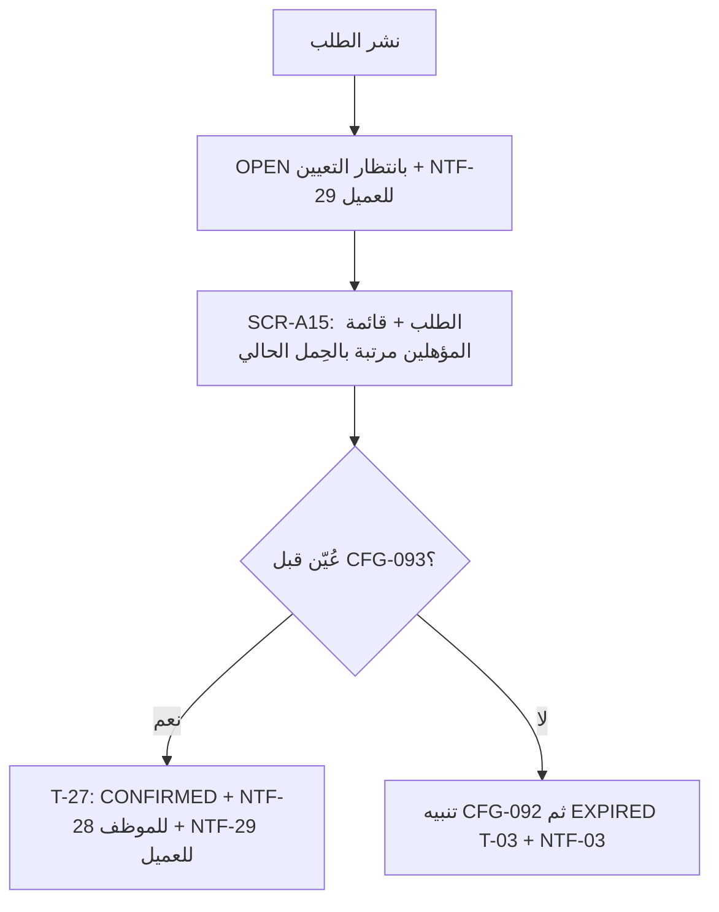

# 08 — توزيع الطلب

القرار: بث لكل المؤهلين، بلا موجات ولا حد لعدد المستلمين (DEC-002).

> **تسري في وضع السوق فقط** (CFG-090 مفعّل). في وضع الموظفين لا بث ولا عروض: الطلب يظهر في لوحة التوزيع (SCR-A15) ويعيّنه مدير التشغيل يدويًا — §التعيين اليدوي أدناه و39-OPERATING-MODES.

## قواعد
- الأهلية: BR-022. ما يراه الفني قبل التأكيد: BR-024.
- **الظهور المستمر**: قائمة "الطلبات المتاحة" تُحسب عند الطلب؛ الفني الذي يصبح مؤهلًا لاحقًا (فعّل "متاح الآن" مثلًا) يرى الطلبات المفتوحة دون إشعار جديد.
- **تعارض المواعيد** للطلبات المجدولة يُفحص عند تقديم العرض (تحذير) وعند القبول (منع) — BR-034.
- **الترتيب في قائمة الفني**: الأحدث أولًا، مع إبراز طلبات NOW.
- **لا توسيع تلقائي للنطاق** (DEC-002 بديل مرفوض). التوسع يتم بإضافة مناطق للفني أو فنيين جدد.

## التعيين اليدوي (وضع الموظفين — CFG-090 معطّل)

- الأهلية: BR-022 بنودها 1، 2، 3، 5، 6 (البند 4 خاص بالمنع من العروض ولا يُطبق — BR-065).
- شرط الموعد يُفحص عند التعيين لا عند العرض: طلب `NOW` لموظف بلا طلب `NOW` نشط، وطلب مجدول بلا فترة متداخلة (نفس شروط BR-034).
- لا إشعار NTF-01 في هذا الوضع؛ الموظف يُشعَر بالتعيين فقط (NTF-28).
- إعادة التعيين قبل الوصول: T-29 (اعتذار + تعيين بديل في معاملة واحدة)، ويُسجل الحدثان.
- لا توجد قائمة "بدون عروض" في هذا الوضع؛ محلها عدّاد "طلبات بلا تعيين" في لوحة الإدارة.

## عدم وصول عروض
- عند `offers_close_at` بلا عروض: إشعار للعميل NTF-02 بإعادة النشر أو التعديل.
- إعادة النشر (`republish`) مسموحة من `OPEN` بلا عروض أو من `EXPIRED`: تبدأ نافذة جديدة وإشعار جديد للمؤهلين، وتُسجل EVT-003. الطلب `EXPIRED` يُعاد نشره كطلب جديد مرتبط بالأصلي (`republished_from_id`) للحفاظ على السجل.
- الإدارة ترى هذه الطلبات في قائمة "بدون عروض" ويمكنها التواصل مع فنيين خارج النظام لدعوتهم للتقديم (لا تعيين يدوي — DEC-002).
