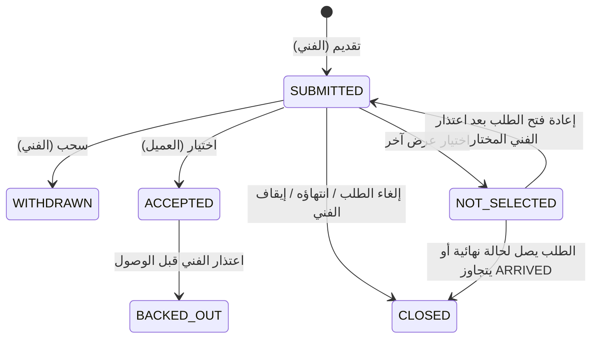

# 09 — دورة حياة العرض

> **تسري في وضع السوق فقط** (CFG-090 مفعّل). في وضع الموظفين لا توجد عروض، ويحل محلها التعيين الإداري (BR-007، T-27، 39-OPERATING-MODES). الاستثناء الوحيد: صف التعيين يُكتب في نفس الجدول بحالة `ACCEPTED` وسعر `0.00` و`source = ADMIN_ASSIGNMENT`، ولا تسري عليه انتقالات O-01..O-07 ولا يظهر لأي طرف كعرض.

| الحالة | المعنى | يراها العميل؟ |
|---|---|---|
| `SUBMITTED` | عرض نشط قابل للاختيار | نعم |
| `WITHDRAWN` | سحبه الفني قبل الاختيار | لا |
| `ACCEPTED` | العرض المختار (واحد فقط لكل طلب) | نعم |
| `NOT_SELECTED` | لم يُختر؛ قد يعود نشطًا (BR-036) | لا |
| `CLOSED` | انتهى بانتهاء الطلب | لا |
| `BACKED_OUT` | الفني المختار اعتذر | لا (يظهر للإدارة) |

## الانتقالات
| الرمز | من | الإجراء | المنفذ | الشروط | إلى |
|---|---|---|---|---|---|
| O-01 | — | `submitOffer` | الفني | BR-022، BR-030..BR-032 | SUBMITTED |
| O-02 | SUBMITTED | `withdrawOffer` | الفني | الطلب `OPEN` | WITHDRAWN |
| O-03 | SUBMITTED | `acceptOffer` | العميل | BR-034 | ACCEPTED |
| O-04 | SUBMITTED | (نتيجة O-03 لعرض آخر) | النظام | — | NOT_SELECTED |
| O-05 | NOT_SELECTED | (اعتذار الفني المختار) | النظام | صاحب العرض يستوفي BR-034 | SUBMITTED |
| O-06 | SUBMITTED / NOT_SELECTED | (الطلب CANCELLED/EXPIRED/ARRIVED، أو إيقاف الفني BR-131) | النظام | — | CLOSED |
| O-07 | ACCEPTED | `backOut` | الفني | الطلب `CONFIRMED` أو `ON_THE_WAY` | BACKED_OUT |

## قواعد مرجعية
BR-030 إلى BR-036، BR-024 (ما يراه الفني)، BR-100 (المحادثة)، BR-006/007 (الوضع).

## ما يظهر للعميل في كارت العرض (SCR-C06)
صورة الفني وشارة التوثيق، الاسم، التقييم، عدد الخدمات، السعر، "يصل خلال X دقيقة" (NOW فقط)، شارة ترتيب تلقائية (الأعلى تقييمًا / أفضل سعر / الأسرع)، وفي طلب المعاينة شارة "تُخصم من المصنعية" إن وُجدت. الترتيب "الأسرع وصولًا" يختفي في الطلبات المجدولة (DEC-004).

## ما يراه الفني
- عند كتابة العرض: "صافي لك = السعر × (1 − نسبة العمولة الحالية)" (DEC-009).
- حالة كل عروضه في "عروضي" (SCR-P11).
