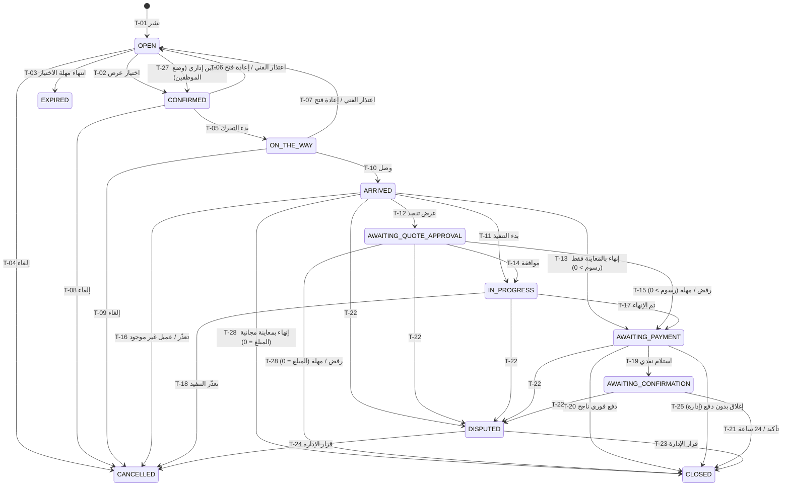

# 10 — دورة حياة الطلب (الوثيقة الأهم)

الطلب كيان واحد من النشر حتى الإغلاق (DEC-027). الحالة لا تتغير إلا عبر إجراء في جدول الانتقالات؛ أي انتقال غير مذكور **مرفوض** (خطأ `INVALID_TRANSITION`).

الحالات واحدة في وضعي التشغيل (39). ما يختلف هو **مدخل** `CONFIRMED`: اختيار عرض (T-02) في وضع السوق، أو تعيين إداري (T-27) في وضع الموظفين؛ ومخرج المعاينة المجانية (T-28).

## جدول الانتقالات
| الرمز | من | الإجراء (API) | المنفذ | الشروط | إلى | الحدث |
|---|---|---|---|---|---|---|
| T-01 | — | `publishRequest` | العميل | 07، BR-001، BR-019 | OPEN | EVT-001 |
| T-02 | OPEN | `acceptOffer` | العميل | BR-034 | CONFIRMED | EVT-010 |
| T-03 | OPEN | (مهلة) | النظام | `now ≥ selection_deadline_at` ولا عرض مقبول؛ في وضع الموظفين `selection_deadline_at` = مهلة التعيين CFG-093 | EXPIRED | EVT-005 |
| T-04 | OPEN | `cancelOrder` | العميل / الإدارة | سبب إلزامي | CANCELLED | EVT-090 |
| T-05 | CONFIRMED | `startTrip` | الفني | صلاحية الموقع؛ للمجدول: `now ≥ slot_start − 90 دقيقة` | ON_THE_WAY | EVT-020 |
| T-06/07 | CONFIRMED / ON_THE_WAY | `backOut` / `adminReopen` | الفني / الإدارة | سبب إلزامي | OPEN | EVT-012 |
| T-08/09 | CONFIRMED / ON_THE_WAY | `cancelOrder` | العميل / الإدارة | سبب إلزامي | CANCELLED | EVT-090 |
| T-10 | ON_THE_WAY | `markArrived` | الفني | يُرسل الموقع (BR-111) | ARRIVED | EVT-022 |
| T-11 | ARRIVED | `startWork` | الفني | `pricing_mode = EXECUTION` | IN_PROGRESS | EVT-030 |
| T-12 | ARRIVED | `submitProposal(EXECUTION_QUOTE)` | الفني | `INSPECTION`، BR-041..043 | AWAITING_QUOTE_APPROVAL | EVT-040 |
| T-13 | ARRIVED | `completeInspectionOnly` | الفني | `INSPECTION` ولم يُقدَّم عرض تنفيذ، ورسوم المعاينة > 0 | AWAITING_PAYMENT | EVT-035 |
| T-14 | AWAITING_QUOTE_APPROVAL | `approveProposal` | العميل | المقترح `PENDING` | IN_PROGRESS | EVT-041 |
| T-15 | AWAITING_QUOTE_APPROVAL | `rejectProposal` / مهلة | العميل / النظام | — | AWAITING_PAYMENT (رسوم المعاينة فقط) | EVT-042/043 |
| T-16 | ARRIVED | `reportUnableToPerform` / `reportCustomerNoShow` | الفني | سبب؛ عدم الحضور بعد CFG-033 | CANCELLED | EVT-091/092 |
| T-17 | IN_PROGRESS | `completeWork` | الفني | لا مقترح معلّق (BR-045) | AWAITING_PAYMENT | EVT-050 |
| T-18 | IN_PROGRESS | `reportUnableToPerform` | الفني | سبب | CANCELLED | EVT-091 |
| T-19 | AWAITING_PAYMENT | `confirmCashReceived` / `adminRecordCash` | الفني / الإدارة | المبلغ = `final_amount` | AWAITING_CONFIRMATION | EVT-061 |
| T-20 | AWAITING_PAYMENT | (إشعار فوري ناجح) | النظام | توقيع صحيح، المبلغ مطابق | CLOSED | EVT-062، EVT-070 |
| T-21 | AWAITING_CONFIRMATION | `confirmCompletion` / مهلة CFG-051 | العميل / النظام | — | CLOSED | EVT-070/071 |
| T-22 | ARRIVED … AWAITING_CONFIRMATION | `openDispute` | العميل / الفني | سبب إلزامي | DISPUTED | EVT-080 |
| T-23 | DISPUTED | `resolveDispute(close)` | الإدارة | تحديد المبالغ النهائية والدفع | CLOSED | EVT-081 |
| T-24 | DISPUTED | `resolveDispute(cancel)` | الإدارة | استرداد كامل لأي دفع إلكتروني | CANCELLED | EVT-081 |
| T-25 | AWAITING_PAYMENT | `adminCloseWithoutPayment` | الإدارة | سبب؛ العمولة = 0 (BR-055) | CLOSED | EVT-072 |
| T-26 | OPEN … IN_PROGRESS | `adminCancel` | الإدارة | سبب | CANCELLED | EVT-090 |
| T-27 | OPEN | `assignProvider` | الإدارة | CFG-090 معطّل، مقدم الخدمة يستوفي BR-007 | CONFIRMED | EVT-011 |
| T-28 | ARRIVED / AWAITING_QUOTE_APPROVAL | `completeInspectionOnly` / `rejectProposal` / مهلة | الفني / العميل / النظام | `final_amount = 0` (BR-056) | CLOSED | EVT-036 |
| T-29 | CONFIRMED / ON_THE_WAY | `reassignProvider` | الإدارة | CFG-090 معطّل؛ = T-06/07 + T-27 في معاملة واحدة | CONFIRMED | EVT-012 + EVT-011 |

## تفاصيل كل حالة
| الحالة | المعنى | الإجراءات المسموحة | المهلة | الإشعارات | تدخل الإدارة | الإلغاء |
|---|---|---|---|---|---|---|
| **OPEN** استقبال العروض | منشور ويقبل عروضًا حتى `offers_close_at`، والاختيار حتى `selection_deadline_at` | عميل: قبول، تعديل (BR-021)، إعادة نشر، إلغاء، محادثة. فني: تقديم/سحب عرض | T-03 | NTF-01، 02، 03، 04 | إلغاء | عميل/إدارة مجانًا |
| **OPEN** بانتظار التعيين *(وضع الموظفين)* | منشور بلا عروض، ينتظر تعيين مدير التشغيل | عميل: تعديل (لا عروض تمنعه)، إعادة نشر، إلغاء. إدارة: تعيين (T-27) | تنبيه CFG-092، انتهاء CFG-093 ← T-03 | NTF-28، 29، 02، 03 | تعيين، إلغاء | عميل/إدارة مجانًا |
| **CONFIRMED** تم التأكيد | فني مختار؛ العنوان والهاتف ظاهران له | فني: بدء التحرك، اعتذار. عميل: إلغاء، اتصال، محادثة، تغيير طريقة الدفع | تذكير CFG-031، تنبيه CFG-032 | NTF-05، 06، 07 | إعادة فتح، إلغاء | عميل مجانًا؛ فني = اعتذار |
| **ON_THE_WAY** في الطريق | الفني متحرك ويرسل موقعه | فني: وصل، اعتذار. عميل: تتبع، مشاركة، إلغاء | تنبيه CFG-032b | NTF-08 | إعادة فتح، إلغاء | عميل مجانًا؛ فني = اعتذار |
| **ARRIVED** وصل | الفني عند العميل | فني: بدء التنفيذ / عرض تنفيذ / إنهاء بالمعاينة (T-13 أو T-28) / تعذّر / عميل غير موجود. الطرفان: فتح مشكلة | — | NTF-09 | إلغاء | عميل ✗ (مشكلة فقط)؛ فني: تعذّر/غير موجود |
| **AWAITING_QUOTE_APPROVAL** | عرض تنفيذ بعد المعاينة ينتظر العميل | عميل: موافقة/رفض. الطرفان: فتح مشكلة | CFG-040 ← T-15 أو T-28 | NTF-10 | إلغاء (T-26) | ✗ |
| **IN_PROGRESS** جاري التنفيذ | العمل جارٍ | فني: مقترحات، إنهاء، تعذّر. عميل: الموافقة على المقترحات. الطرفان: مشكلة | مهلة المقترح فقط | NTF-11، 10، 12 | إلغاء | عميل ✗؛ فني: تعذّر |
| **AWAITING_PAYMENT** | المبلغ النهائي محسوب وينتظر الدفع | عميل: دفع فوري، تحويل إلى نقدي. فني: تأكيد الاستلام النقدي. الطرفان: مشكلة | تنبيه CFG-050 (بلا إغلاق) | NTF-13، 14 | تسجيل دفع نقدي، إغلاق بدون دفع | ✗ |
| **AWAITING_CONFIRMATION** | دُفع نقدًا وينتظر تأكيد العميل | عميل: تأكيد، مشكلة. فني: مشكلة | CFG-051 ← إغلاق | NTF-15 | — | ✗ |
| **DISPUTED** قيد المراجعة | مشكلة مفتوحة قبل الإغلاق | الطرفان: إضافة تفاصيل. الإدارة: قرار | لا مهلة آلية | NTF-17 | قرار نهائي | عبر القرار |
| **CLOSED** مكتمل | نهائية | تقييم، نزاع بعد الإغلاق (BR-120) | CFG-060، CFG-070، CFG-071 | NTF-16، 18 | إخفاء تقييم، استرداد عبر نزاع | ✗ |
| **CANCELLED** ملغي | نهائية، مع `cancelled_by` و`cancel_reason_code` | عرض فقط | — | NTF-19 | — | — |
| **EXPIRED** منتهي | نهائية؛ لم يُختر عرض | إعادة نشر كطلب جديد (08) | — | NTF-03 | — | — |

## آثار جانبية عند الدخول إلى حالة
| الحالة | الأثر |
|---|---|
| CONFIRMED | BR-035؛ فتح الهاتف (BR-101)؛ تثبيت العمولة (في وضع الموظفين = 100%، BR-065)؛ في T-27 يُنشأ صف التعيين (BR-007) |
| OPEN (إعادة فتح) | BR-036؛ نافذة جديدة؛ `reopen_count + 1`؛ إخفاء بيانات العميل عن الفني المعتذر |
| ARRIVED | حفظ نقطة الوصول؛ حذف المسار؛ إغلاق العروض `NOT_SELECTED` (O-06) |
| AWAITING_PAYMENT | حساب المبالغ (BR-044) وتثبيتها |
| DISPUTED / CANCELLED | إغلاق أي مقترح معلّق كـ `WITHDRAWN`؛ إيقاف التتبع |
| CLOSED | حساب العمولة (BR-060)؛ `settlement_eligible_at`؛ حذف المسار؛ فتح التقييم؛ بريد ملخص الطلب. عبر T-28: المبالغ = 0 وحالة الدفع `WAIVED` (BR-056) |
| CANCELLED / EXPIRED | إغلاق العروض (O-06)؛ المحادثات للقراءة فقط |

## انتقالات ممنوعة صراحة
- أي رجوع من `ARRIVED` أو بعدها إلى حالة سابقة.
- `IN_PROGRESS` ← `AWAITING_PAYMENT` مع مقترح معلّق.
- إلغاء العميل بعد `ARRIVED`.
- أي خروج من `CLOSED` / `CANCELLED` / `EXPIRED`.
- تغيير الحالة مباشرة من أي واجهة (PATCH status) — غير موجود في API.
- T-02 في وضع الموظفين، وT-27/T-29 في وضع السوق (`FEATURE_DISABLED`).
- T-13/T-15 مع `final_amount = 0` (يحل محلهما T-28)، وT-28 مع `final_amount > 0`.

## التزامن
كل إجراء يقفل صف الطلب (`SELECT … FOR UPDATE`) ويتحقق من الحالة الحالية داخل نفس المعاملة، مع عمود `version` للقفل المتفائل في الواجهات. طلبان متزامنان على نفس الطلب: الأول ينجح، والثاني يعود بـ `INVALID_TRANSITION` أو `CONFLICT`.
