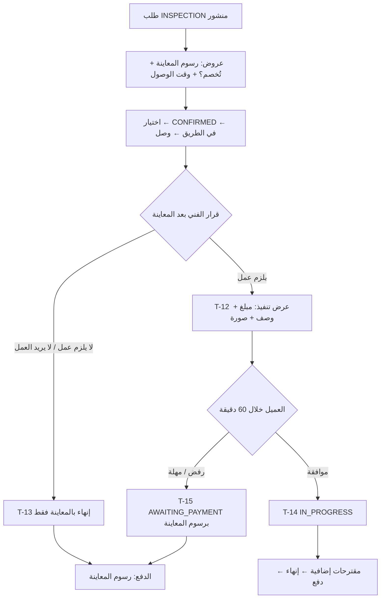

# 11 — مسار المعاينة أولًا

طلب واحد بمراحل متتابعة (DEC-005، بديل C: كل فني يحدد في عرضه هل تُخصم الرسوم).

> **في المرحلة الأولى** (CFG-091 معطّل) رسوم المعاينة = **صفر**، وكل طلب يسلك هذا المسار (BR-008، DEC-040). المخطط والقواعد أدناه تصف الحالة العامة؛ ما يختلف عند الرسوم الصفرية مذكور في §المعاينة المجانية.

## القواعد
- عرض المعاينة: `price` = رسوم المعاينة، `inspection_fee_deductible` إلزامي (BR-032).
- عرض التنفيذ `EXECUTION_QUOTE` مرة واحدة، لا يُسحب، ويجب ≥ الرسوم إن كانت تُخصم (BR-042، BR-043).
- حساب المبلغ: BR-044. مثال: رسوم 100 تُخصم + عرض تنفيذ 450 + خامات 200 = مصنعية 450، خامات 200، إجمالي 650. بدون خصم: مصنعية 550، إجمالي 750.
- العمولة على المصنعية فقط (BR-060)، بما فيها رسوم المعاينة المدفوعة.
- رفض العرض لا يلغي الطلب؛ الطلب يُدفع ويُغلق ويُقيَّم كطلب معاينة.
- لا زيارة ثانية داخل نفس الطلب (DEC-029). العميل الذي يريد التنفيذ لاحقًا ينشر طلبًا جديدًا.

## المعاينة المجانية (CFG-091 معطّل — المرحلة الأولى)
- لا حقل رسوم ولا حقل "تُخصم من المصنعية" في أي واجهة؛ `inspection_fee = 0` و`inspection_fee_deductible` بلا معنى (BR-043 لا تُطبق).
- `EXECUTION_QUOTE` هو **الوحيد** الذي يحدد المصنعية: `labor_base = quote` (لا شيء يُخصم منه ولا يُضاف إليه).
- رفض العميل أو انتهاء المهلة أو إنهاء الفني بالمعاينة فقط ← `final_amount = 0` ← الطلب يُغلق مباشرة بلا دفع (BR-056، T-28)، وحالة الدفع `WAIVED`، والتقييم متاح كالمعتاد.
- الزيارة المجانية تظل مُسجَّلة كاملة (وصول، مدة، سبب عدم التنفيذ) في سجل الأحداث، وتُحتسب ضمن إحصاءات مقدم الخدمة.
- مثال: معاينة مجانية + عرض تنفيذ 450 + خامات 200 = مصنعية 450، خامات 200، إجمالي 650.

## ما يراه العميل
- في SCR-C06 (وضع السوق): "رسوم المعاينة" بدل "السعر"، وشارة "تُخصم من المصنعية". في وضع الموظفين لا تظهر SCR-C06 أصلًا (39).
- في المرحلة الأولى: نص واضح عند النشر وفي التتبع "المعاينة مجانية، والسعر يُعرض عليك بعد الكشف ولك قبوله أو رفضه".
- في SCR-C30 (موافقة عرض التنفيذ): المبلغ، الوصف، الصورة، الإجمالي المتوقع بعد الخصم، عداد المهلة، أزرار موافقة/رفض.
