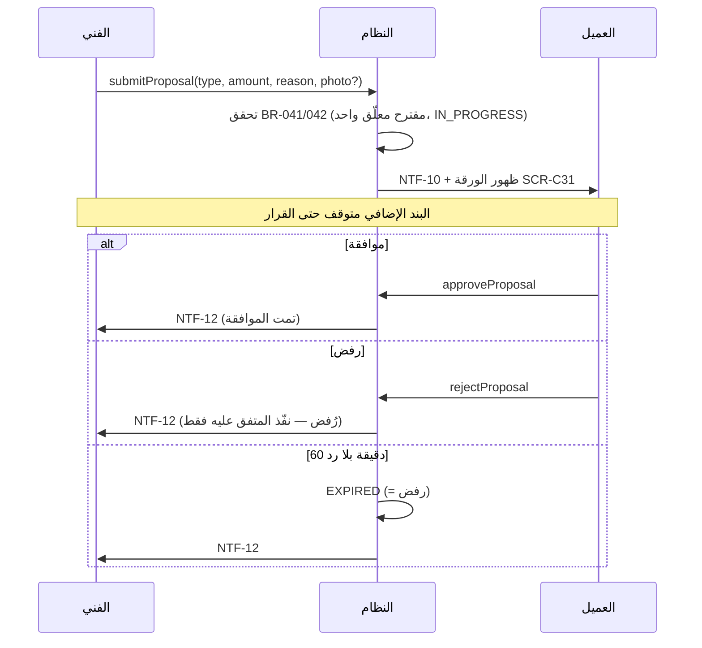

# 12 — التكلفة الإضافية (مقترحات السعر)

كيان واحد `PriceProposal` بثلاثة أنواع (DEC-007): `EXECUTION_QUOTE` (11)، `MATERIALS`، `EXTRA_WORK`.

## الحقول
| الحقل | إلزامي | ملاحظة |
|---|---|---|
| النوع | نعم | `MATERIALS` أو `EXTRA_WORK` |
| المبلغ | نعم | > 0 |
| السبب/الوصف | نعم | 5–300 حرف |
| صورة | لا | صورة واحدة (فاتورة خامات مثلًا) |

## القواعد
- السعر الأصلي لا يتغير (BR-040)؛ الإجمالي يُعاد حسابه من المقترحات الموافق عليها فقط (BR-044).
- الفني يستطيع سحب مقترح `MATERIALS`/`EXTRA_WORK` معلّق ثم تقديم غيره.
- لا إنهاء مع مقترح معلّق (BR-045).
- رفض العميل لا يلغي الطلب: يُنفَّذ المتفق عليه. إذا لم يعد التنفيذ ممكنًا بدون البند المرفوض، يُنهي الفني العمل بما نُفّذ (T-17) أو يسجل "تعذّر التنفيذ" (T-18) إن لم يُنفذ شيء، وللعميل فتح مشكلة.
- سجل كل المقترحات (بما فيها المرفوضة) يظهر في تفاصيل الطلب وفي سجل الإدارة.
- لا مخزون ولا مشتريات؛ الخامات مجرد مبلغ.
