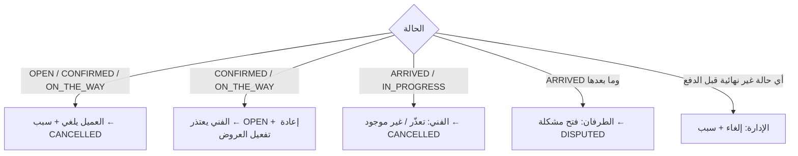

# 13 — الإلغاء

لا رسوم ولا غرامات في النسخة الأولى (DEC-016). كل إلغاء يسجل: المنفذ، رمز السبب، ملاحظة اختيارية، الوقت.

## رموز الأسباب
- **العميل**: `FOUND_ANOTHER`, `NO_LONGER_NEEDED`, `PRICE_TOO_HIGH`, `PROVIDER_LATE`, `WRONG_DETAILS`, `OTHER`
- **الفني** (اعتذار/تعذّر): `EMERGENCY`, `CANNOT_REACH`, `OUT_OF_SCOPE`, `UNSAFE_SITE`, `CUSTOMER_NO_SHOW`, `WRONG_ADDRESS`, `OTHER`
- **الإدارة**: `ADMIN_POLICY`, `FRAUD_SUSPECTED`, `DUPLICATE`, `ACCOUNT_BLOCKED`, `OTHER`

## المصفوفة
| المرحلة | العميل | الفني | الإدارة | إعادة نشر؟ | ملاحظات |
|---|---|---|---|---|---|
| قبل النشر | الخروج من المعالج (لا يوجد طلب) | — | — | — | لا مسودة على الخادم |
| OPEN بلا عروض | ✓ مجانًا + سبب | — | ✓ | — | — |
| OPEN بانتظار التعيين *(موظفين)* | ✓ مجانًا + سبب | — | ✓ | — | التعديل متاح دائمًا (لا عروض تمنعه) |
| OPEN مع عروض | ✓ مجانًا + سبب | سحب عرضه فقط | ✓ | — | العروض ← CLOSED + NTF-19 لأصحابها |
| CONFIRMED | ✓ مجانًا + سبب | اعتذار ← OPEN | ✓ إلغاء أو إعادة فتح | تلقائي عند الاعتذار | BR-036؛ في وضع الموظفين الاعتذار يعيد الطلب لانتظار التعيين أو تعيد الإدارة تعيينه مباشرة (T-29) |
| ON_THE_WAY | ✓ مجانًا + سبب | اعتذار ← OPEN | ✓ | تلقائي عند الاعتذار | يُسجل إن كان السبب `PROVIDER_LATE` |
| ARRIVED | ✗ ← فتح مشكلة | تعذّر / عميل غير موجود (بعد 20 دقيقة) | ✓ | لا | بلا أي مبلغ |
| AWAITING_QUOTE_APPROVAL | ✗ (الرفض ≠ إلغاء) ← مشكلة | ✗ | ✓ | لا | الرفض ← دفع رسوم المعاينة؛ وبمعاينة مجانية ← إغلاق بلا أي مبلغ (T-28) |
| IN_PROGRESS | ✗ ← مشكلة | تعذّر (إن لم يُنفذ شيء) | ✓ | لا | — |
| بعد مقترح معلّق | كالحالة الأصلية؛ الإلغاء/النزاع يغلق المقترح | — | — | — | — |
| AWAITING_PAYMENT / CONFIRMATION | ✗ ← مشكلة | ✗ ← مشكلة | عبر نزاع أو إغلاق بدون دفع | لا | — |
| CLOSED | ✗ ← نزاع خلال 72 ساعة | ✗ | استرداد عبر نزاع | لا | — |

## المتابعة التشغيلية
الإدارة ترى لكل عميل وفني: عدد الإلغاءات والاعتذارات آخر 30 يومًا (16). لا إجراء آلي؛ القرار (تنبيه، إيقاف) للإدارة.
