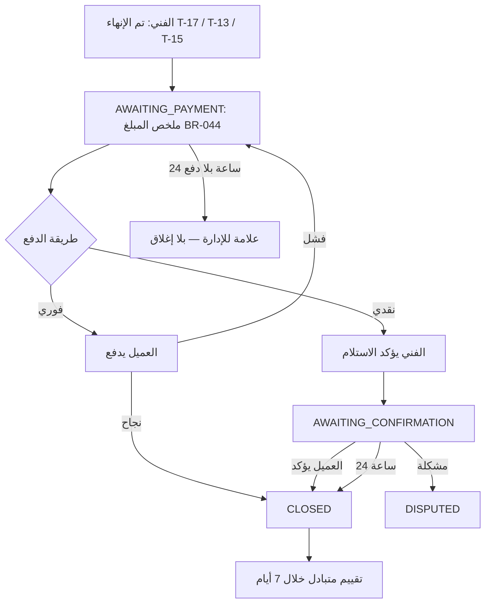

# 14 — الإنهاء والتقييم

## الإنهاء
- الفني يضغط "تم الإنهاء" بعد التحقق من BR-045. يُعرض عليه وعلى العميل ملخص: المصنعية، الخامات، الإجمالي، طريقة الدفع.
- العميل يرى زر "ادفع الآن" (فوري) أو "في انتظار تأكيد الفني لاستلام المبلغ" (نقدي)، مع إمكانية تبديل الطريقة (BR-050).

## التأكيد
- الدفع الإلكتروني الناجح يُعد تأكيدًا (BR-052).
- النقدي: العميل يؤكد، أو إغلاق تلقائي بعد 24 ساعة (BR-080)، أو فتح مشكلة.
- الإدارة لا تغلق طلبًا يدويًا إلا عبر: تسجيل دفع نقدي (T-19)، إغلاق بدون دفع (T-25)، أو قرار نزاع (T-23).

## التقييم
| | العميل ← الفني | الفني ← العميل |
|---|---|---|
| متى | بعد CLOSED، خلال 7 أيام | بعد CLOSED، خلال 7 أيام |
| المحتوى | 3 أبعاد (1–5) + نص اختياري | نجوم 1–5 |
| الظهور | علني في ملف الفني باسم مختصر، شارة "خدمة مؤكدة"، نوع المشكلة | متوسط يظهر للفنيين في تفاصيل الطلب |
| التعديل | لا | لا |
| الإشراف | الإدارة تخفي المسيء | الإدارة تخفي |

- المتوسط المعروض للفني = متوسط الأبعاد الثلاثة للتقييمات الظاهرة، ويظهر كل بعد منفصلًا (مطابق SCR-C07).
- تذكير واحد بالتقييم بعد 24 ساعة من الإغلاق (NTF-18).
- الطلبات الملغاة والمنتهية لا تُقيّم (BR-092).
