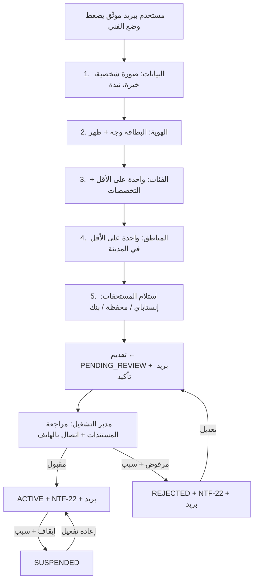

# 15 — تسجيل الفني وتوثيقه

المسار أدناه هو التسجيل الذاتي في وضع السوق. في المرحلة الأولى (وضع الموظفين) الإدارة هي من تنشئ ملفات الموظفين وتراجعها وتضبط `employment_type = EMPLOYEE`، ويظل التسجيل الذاتي متاحًا لاستقبال طلبات الانضمام المستقبلية وتبقى في `PENDING_REVIEW` حتى تفعيل وضع السوق (39).

## المتطلبات (DEC-022، DEC-033)
| البند | إلزامي | ملاحظة |
|---|---|---|
| صورة شخصية واضحة | نعم | تظهر في الملف والعروض |
| البطاقة الشخصية (وجهان) | نعم | تخزين خاص، تراها الإدارة فقط |
| الهاتف | نعم | من حساب المستخدم؛ يوثّق باتصال من الإدارة (`phone_verified_at`) |
| الفئات + التخصصات | نعم (فئة واحدة) | التخصصات = أنواع مشاكل للعرض (DEC-024) |
| المناطق | نعم (منطقة واحدة) | من مناطق المدن المفعّلة |
| سنوات الخبرة | نعم | رقم 0–50، يُعرض كما هو |
| نبذة | لا | 300 حرف |
| صور أعمال | لا | حتى 20 صورة |
| استلام المستحقات | نعم | النوع + البيانات (رقم إنستاباي/محفظة أو IBAN)؛ مشفرة. للموظف تُستخدم في رد قيمة الخامات (BR-065) |
| صفة التعاقد | تحددها الإدارة | `EMPLOYEE` / `INDEPENDENT` — لا يراها مقدم الخدمة ولا تغير مسار التسجيل (39) |

## قائمة مراجعة الإدارة
1. تطابق الاسم مع البطاقة ووضوح الصور.
2. تطابق الصورة الشخصية مع صورة البطاقة.
3. الاتصال بالهاتف وتأكيد الهوية والفئات ← تسجيل "الهاتف موثّق".
4. قبول أو رفض مع سبب إلزامي.

## ما بعد التفعيل
- يعدّل بنفسه: الصورة، النبذة، الخبرة، التخصصات داخل فئاته، المناطق، معرض الأعمال، "متاح الآن".
- لا يعدّل بنفسه: الفئات، بيانات الهوية، بيانات استلام المستحقات ← طلب عبر الدعم وتنفذه الإدارة (BR-130).
- الإيقاف: BR-131. الحظر الكامل للحساب: BR-003.
