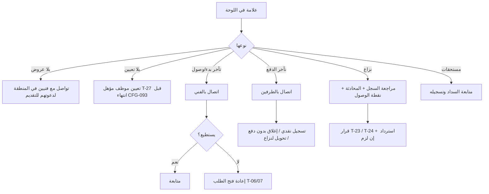

# 16 — عمليات الإدارة (لوحة Filament)

لوحة تشغيل، ليست ERP. كل شاشة تخدم قرارًا تشغيليًا.

## الوحدات
| الوحدة | الدور | المحتوى |
|---|---|---|
| **اللوحة الرئيسية** | الكل | عدادات قابلة للنقر: طلبات بلا فنيين مؤهلين، طلبات بلا عروض، **طلبات بلا تعيين (وضع الموظفين)**، تأخر بدء التحرك، تأخر الوصول، وصول بعيد عن العنوان، تأخر الدفع > 24 ساعة، نزاعات مفتوحة، فنيون بانتظار المراجعة، فنيون تجاوزوا حد المستحقات، بلاغات جديدة |
| **التوزيع والتعيين** (SCR-A15) | الكل | *(وضع الموظفين فقط — CFG-090 معطّل)* الطلبات `OPEN` بلا تعيين مرتبة بالأقرب للمهلة، ولكل طلب قائمة المؤهلين (BR-007) مع حِملهم الحالي وتعارض المواعيد، وأزرار **تعيين** (T-27) و**إعادة تعيين** (T-29) بسبب إلزامي |
| **الطلبات** | الكل | بحث بالرقم/العميل/الفني، تصفية بالحالة والمنطقة والفئة والتاريخ، صفحة تفاصيل بها **السجل الزمني الكامل** (24)، العروض، المقترحات، الدفعات، المحادثات (قراءة فقط عند وجود نزاع أو بلاغ)، ونقطة الوصول |
| **الفنيون** | الكل | قائمة المراجعة، الملف، المستندات، تسجيل توثيق الهاتف، قبول/رفض، إيقاف/تفعيل، تعديل الفئات وبيانات الاستلام بطلب منه، الإلغاءات والاعتذارات آخر 30 يومًا |
| **العملاء** | الكل | الملف، الطلبات، الإلغاءات، حظر/رفع حظر مع سبب |
| **النزاعات** | الكل | قائمة، تفاصيل، قرار |
| **البلاغات** | الكل | بلاغات عن فنيين، إغلاق مع ملاحظة |
| **التقييمات** | الكل | إخفاء/إظهار مع سبب |
| **الكتالوج** | الكل | الفئات (اسم، أيقونة، ترتيب، تفعيل، مدن) وأنواع المشاكل |
| **المدن والمناطق** | المدير العام | إضافة، تفعيل، إيقاف |
| **المال** | المدير العام | *(وضع الموظفين: توريد الموظفين اليومي ورد قيمة الخامات — BR-065)* كشف كل فني (BR-062)، تسجيل سداد من فني، تسجيل تحويل لفني، قائمة التحويلات الأسبوعية المستحقة، الاستردادات، ملخص عمولات حسب الفترة |
| **الإعدادات** | المدير العام | جدول CFG في 04، **مفتاحا وضع التشغيل CFG-090/CFG-091** (39)، نسخ الشروط |
| **مستخدمو الإدارة** | المدير العام | إضافة، تعطيل، الدور |

## التدخلات على الطلب
| الإجراء | من حالات | النتيجة | المرجع |
|---|---|---|---|
| تعيين مقدم خدمة (وضع الموظفين) | OPEN | CONFIRMED | T-27 |
| إعادة تعيين (وضع الموظفين) | CONFIRMED، ON_THE_WAY | CONFIRMED لمقدم خدمة آخر | T-29 |
| إلغاء | OPEN … IN_PROGRESS | CANCELLED | T-26 |
| إعادة فتح | CONFIRMED، ON_THE_WAY | OPEN | T-06/07 |
| تسجيل دفع نقدي | AWAITING_PAYMENT | AWAITING_CONFIRMATION | T-19 |
| إغلاق بدون دفع | AWAITING_PAYMENT | CLOSED (عمولة 0) | T-25 |
| قرار نزاع: إغلاق (مع/بدون تعديل مبلغ أو استرداد) | DISPUTED | CLOSED | T-23 |
| قرار نزاع: إلغاء (استرداد كامل) | DISPUTED | CANCELLED | T-24 |
| قرار نزاع بعد الإغلاق | CLOSED + نزاع | يبقى CLOSED، استرداد جزئي/كلي أو لا شيء | BR-120 |

كل تدخل يطلب سببًا ويُسجل في `order_events` باسم المسؤول.

## قرار النزاع — ما يُسجل
النتيجة (`CLOSE_AS_IS`, `CLOSE_ADJUSTED`, `CLOSE_WITH_REFUND`, `CANCEL_FULL_REFUND`, `CLOSE_WITHOUT_PAYMENT`)، المبالغ المعدلة (مصنعية/خامات)، الاسترداد ورقمه المرجعي في فوري، ملاحظة. العمولة تُعاد حسابها (BR-060).
