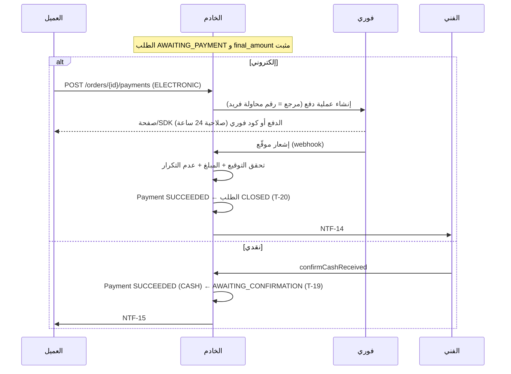
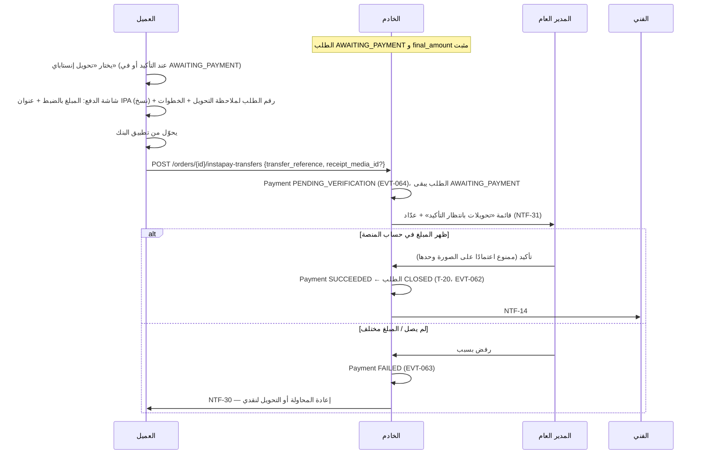
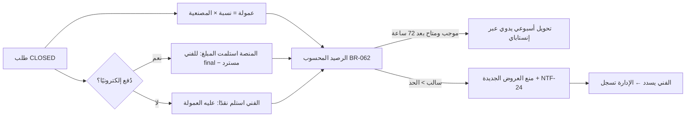

# 19 — الدفع والتسويات (تشغيلي فقط)

لا محاسبة ولا دفاتر قيود (01). النظام يحفظ: مبالغ الطلب، محاولات الدفع، الاستردادات، سداد الفنيين، والتحويلات لهم.

## القنوات (DEC-038)
| الاستخدام | القناة |
|---|---|
| دفع العميل إلكترونيًا — الآن | **تحويل إنستاباي يدوي بتأكيد المدير العام** (`INSTAPAY_MANUAL`، DEC-050) |
| دفع العميل إلكترونيًا — بعد OD-10 | **فوري (FawryPay)**: بطاقة، محفظة، أو كود دفع في منافذ فوري (`FAWRY`) |
| تحويل مستحقات الفني | **إنستاباي** (أو محفظة/بنك حسب بيانات الفني)، يدوي |
| سداد الفني لعمولات المنصة | **إنستاباي** أو أي قناة، يدوي مع رقم مرجعي |

## دفع العميل

### طبقة البوابة قبل فتح حساب فوري (دفعة 4ب)
- تتعامل الشاشات والـ API مع عقد واحد `PaymentGateway`؛ لا يستدعي Android أو iOS فوري ولا يحسب توقيعًا.
- التنفيذ الحالي `StagingPaymentGateway` يحاكي `PENDING` و`PAID` و`FAILED` و`EXPIRED`، ويعيد صفحة مستضافة للبطاقة/المحفظة أو كودًا للمنافذ، ثم يمرر النتيجة عبر **نفس** معالج webhook الموقّع.
- معامل `simulation` مقبول في بيئات `local/testing/staging` فقط مع driver المحاكي، ومحظور في الإنتاج ولا يظهر في واجهة العميل.
- تنفيذ فوري الحقيقي يُضاف بعد حسم OD-10 كتطبيق جديد للعقد نفسه وبالإعدادات، بلا تعديل للشاشات أو حالات Core.
- التوقيع والمفاتيح والحمولة الكاملة لا تُعاد للتطبيق ولا تُكتب في السجل. يسجل webhook نتيجة التحقق وhash لمرجع التاجر فقط، ويعيد HTTP 200 حتى للرسالة المرفوضة دون أي تغيير.

### تحويل إنستاباي بتأكيد الإدارة (DEC-050، BR-057)
`PaymentGateway` يضم ثلاث قنوات: `CASH`، `INSTAPAY_MANUAL`، `FAWRY`. كل قناة تُفعَّل من اللوحة (CFG-053..055) وتصل التطبيق في `GET /config`؛ عنوان إنستاباي والاسم الظاهر والرابط (CFG-056..058) يضبطها المدير العام فقط.

- تأخر التأكيد بعد CFG-050: عدّاد «متأخر» في الإدارة، بلا إغلاق تلقائي (DEC-018).
- المبلغ المؤكد يُحسب في رصيد الفني كالدفع الإلكتروني (BR-062)، والتحويل للفني أسبوعي كما هو.
- نفس المنطق في المنصتين مع حالات اختبار مشتركة (`design/fixtures/SCR-C22`).

### حالات محاولة الدفع (`payments.status`)
`PENDING` → `SUCCEEDED` | `FAILED` | `EXPIRED` | `CANCELLED` (عند تبديل الطريقة). ولإنستاباي: `PENDING_VERIFICATION` → `SUCCEEDED` | `FAILED` | `CANCELLED`. محاولة معلّقة واحدة فقط لكل طلب (`PENDING` أو `PENDING_VERIFICATION`)؛ إنشاء محاولة جديدة يلغي السابقة لدى فوري إن أمكن.

### حالة الدفع على الطلب (`orders.payment_status`)
`UNPAID` → `PAID` → (`PARTIALLY_REFUNDED` | `REFUNDED`)، أو `WAIVED` (إغلاق بدون دفع، ويشمل الإغلاق بمعاينة مجانية بمبلغ صفر — BR-056).

### قواعد
BR-050 إلى BR-055. إشعار فوري مكرر لا يُنشئ أثرًا مضاعفًا (مفتاح `gateway_reference` فريد). وصول دفع ناجح لطلب لم يعد `AWAITING_PAYMENT` (نادر) ← يُسجل ويظهر للإدارة للاسترداد (EC-15).

## الاسترداد (DEC-019)
- بقرار الإدارة داخل نزاع فقط، للمدفوعات الإلكترونية فقط.
- المدير العام ينفذه من لوحة فوري، ثم يسجله في النظام: المبلغ، تقسيمه (مصنعية/خامات)، الرقم المرجعي.
- العمولة تُعاد حسابها (BR-060). المدفوعات النقدية لا تُسترد داخل النظام؛ يُسجل تعديل المبلغ فقط (`CLOSE_ADJUSTED`).

## التسويات في وضع الموظفين (BR-065، DEC-039)
نسبة العمولة المثبتة = 100%، فتعطي معادلة BR-062 المعنى التشغيلي مباشرة بلا جداول إضافية:

| الحالة | الرصيد المحسوب | الإجراء |
|---|---|---|
| طلب نقدي: مصنعية 450 + خامات 200 | −450 | الموظف يورّد 450 (يحتفظ بـ 200 مقابل خامات دفعها) ← `provider_remittances` |
| طلب إلكتروني: مصنعية 450 + خامات 200 | +200 | المنصة ترد له 200 ← `provider_payouts` |
| طلب أُغلق بمعاينة مجانية (المبلغ = 0) | 0 | لا أثر مالي (BR-056) |

التوريد دوريته CFG-094 (يومي)، ولا يُطبق منع العروض (BR-063) لعدم وجود عروض؛ التأخر في التوريد متابعة تشغيلية من مدير التشغيل. عند التحول لوضع السوق تعود CFG-062 لتُطبَّق على الطلبات الجديدة فقط (النسبة مثبتة عند التأكيد — EC-30).

## التسويات مع الفنيين (DEC-010، DEC-017)

### كشف الفني (SCR-P18) — محسوب عند الطلب
| البند | المصدر |
|---|---|
| المحصَّل إلكترونيًا لصالحك | طلبات مغلقة مدفوعة إلكترونيًا − المسترد |
| العمولات | كل الطلبات المغلقة المدفوعة |
| التحويلات إليك | `provider_payouts` |
| سدادك للمنصة | `provider_remittances` |
| **الرصيد** | BR-062 |
| منه متاح للتحويل | طلبات تجاوزت `settlement_eligible_at` بلا نزاع مفتوح |

لا يوجد رصيد يدوي قابل للتعديل؛ أي تصحيح يتم بتسجيل سداد أو تحويل أو قرار نزاع.
