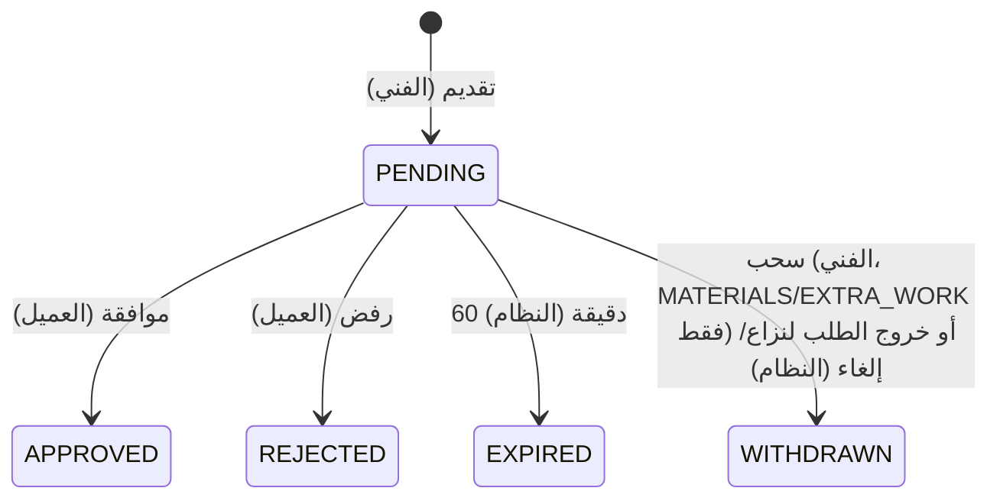
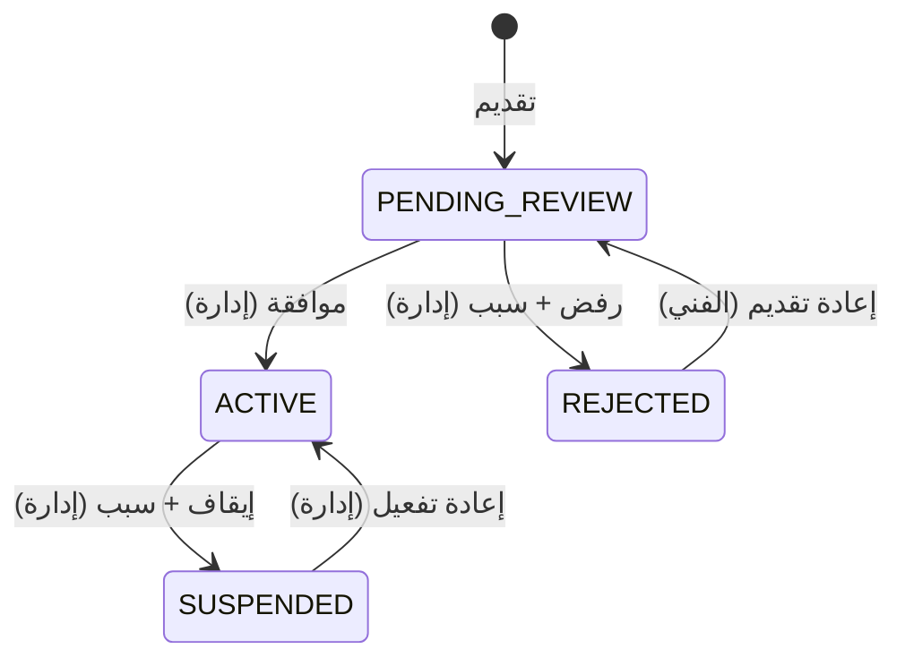

# 21 — نموذج الحالات (المرجع الرسمي)

## 1. الطلب `orders.status`
| الرمز | القيمة | الاسم في الواجهة | نهائية |
|---|---|---|---|
| STATE-ORDER-01 | `OPEN` | استقبال العروض — وفي وضع الموظفين: "بانتظار تعيين فني" (39) | لا |
| STATE-ORDER-02 | `CONFIRMED` | تم التأكيد | لا |
| STATE-ORDER-03 | `ON_THE_WAY` | في الطريق | لا |
| STATE-ORDER-04 | `ARRIVED` | وصل | لا |
| STATE-ORDER-05 | `AWAITING_QUOTE_APPROVAL` | بانتظار موافقتك على عرض التنفيذ | لا |
| STATE-ORDER-06 | `IN_PROGRESS` | جاري التنفيذ | لا |
| STATE-ORDER-07 | `AWAITING_PAYMENT` | بانتظار الدفع | لا |
| STATE-ORDER-08 | `AWAITING_CONFIRMATION` | بانتظار تأكيد الإنهاء | لا |
| STATE-ORDER-09 | `DISPUTED` | قيد المراجعة | لا |
| STATE-ORDER-10 | `CLOSED` | مكتمل | نعم |
| STATE-ORDER-11 | `CANCELLED` | ملغي | نعم |
| STATE-ORDER-12 | `EXPIRED` | منتهي | نعم |

الانتقالات: 10-ORDER-LIFECYCLE (T-01..T-29). لا حالة جديدة في وضع الموظفين؛ الفرق في المداخل والمخارج فقط (39).

**شريط المراحل في شاشة التتبع** (SCR-C09) يعرض: تم التأكيد ← في الطريق ← وصل ← جاري التنفيذ، ويُضاف له في النسخة المعدلة "الدفع" و"مكتمل" (27).

## 2. العرض `offers.status`
`SUBMITTED`, `WITHDRAWN`, `ACCEPTED`, `NOT_SELECTED`, `CLOSED`, `BACKED_OUT` — الانتقالات في 09 (O-01..O-07).
المصدر `offers.source`: `PROVIDER` (عرض حقيقي) أو `ADMIN_ASSIGNMENT` (صف تعيين في وضع الموظفين، يُنشأ مباشرة `ACCEPTED` ولا تسري عليه O-01..O-07 — BR-007).

## 3. مقترح السعر `price_proposals.status`

الأنواع: `EXECUTION_QUOTE`, `MATERIALS`, `EXTRA_WORK` (BR-042).

## 4. ملف الفني `provider_profiles.status`

مؤشرات محسوبة وليست حالات: `available_now` (مفتاح)، "ممنوع من العروض" (BR-063، لا يُطبق في وضع الموظفين).
الصفة `employment_type`: `EMPLOYEE` / `INDEPENDENT` — بيان تعاقدي لا حالة، ولا يؤثر على الانتقالات (39).

## 5. حساب المستخدم `users.status`
`ACTIVE` ↔ `BLOCKED` (إدارة، مع سبب). البريد: `email_verified_at`.

## 6. الدفع
- محاولة الدفع: `PENDING`, `SUCCEEDED`, `FAILED`, `EXPIRED`, `CANCELLED`.
- حالة دفع الطلب: `UNPAID`, `PAID`, `PARTIALLY_REFUNDED`, `REFUNDED`, `WAIVED`.

## 7. النزاع `disputes.status`
`OPEN` → `RESOLVED` (مع `resolution` من 16).

## 8. المحادثة `conversations.status`
`OPEN` → `READ_ONLY`.

## 9. البلاغ `provider_reports.status`
`NEW` → `REVIEWED`.

## اتساق دورات الحياة
| حدث الطلب | أثره على العروض | على المقترحات | على المحادثات |
|---|---|---|---|
| CONFIRMED | المختار ACCEPTED، الباقي NOT_SELECTED (في وضع الموظفين: صف التعيين وحده ACCEPTED) | — | الباقي READ_ONLY |
| OPEN بعد اعتذار | ACCEPTED ← BACKED_OUT، NOT_SELECTED ← SUBMITTED (بشروط) | — | تُعاد فتح محادثات العروض النشطة |
| ARRIVED | NOT_SELECTED ← CLOSED | — | — |
| DISPUTED / CANCELLED | SUBMITTED/NOT_SELECTED ← CLOSED | PENDING ← WITHDRAWN | — |
| نهائية | — | — | READ_ONLY |
