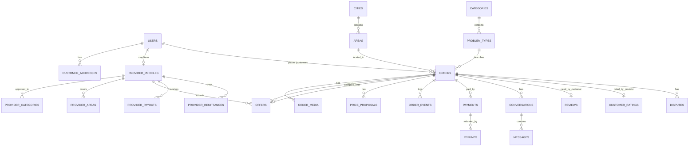

# 29 — تصميم قاعدة البيانات (MariaDB)

قواعد عامة: InnoDB، `utf8mb4_unicode_ci`، مفاتيح `BIGINT UNSIGNED AUTO_INCREMENT`، `created_at/updated_at`، المبالغ `DECIMAL(10,2)` بالجنيه، الإحداثيات `DECIMAL(10,7)`، القيم المحددة `VARCHAR(32)` مع تحقق في التطبيق + `CHECK`، الأوقات UTC. MariaDB لا يدعم الفهارس الفريدة الجزئية؛ نستخدم **أعمدة مولّدة** للقيود الشرطية.

## مخطط الكيانات الأساسي


## الجداول
### الهوية
**users** — `id`, `name` (100), `email` UQ, `email_verified_at`, `password`, `phone` (20), `avatar_path` NULL, `status` (ACTIVE/BLOCKED), `blocked_reason` NULL, `customer_rating_avg` DECIMAL(3,2) NULL, `customer_rating_count` INT, `deleted_at`. فهرس: `status`.
**admins** — `id`, `name`, `email` UQ, `password`, `role` (OPERATIONS/SUPER), `is_active`.
**device_tokens** — `id`, `user_id` FK, `token` UQ, `platform` (ANDROID/IOS), `app_mode` (CUSTOMER/PROVIDER), `last_used_at`.
+ جداول لارافيل: `personal_access_tokens` (Sanctum)، `password_reset_tokens`، `notifications`، `jobs`، `failed_jobs`، `sessions` (للوحة).

### الجغرافيا والكتالوج
**cities** — `id`, `name`, `is_active`, `timezone`, `center_lat`, `center_lng`, `radius_km` NULL.
**areas** — `id`, `city_id` FK, `name`, `is_active`, `sort`. UQ(`city_id`,`name`).
**categories** — `id`, `name`, `icon_path`, `sort`, `is_active`.
**problem_types** — `id`, `category_id` FK, `name`, `is_other` BOOL, `sort`, `is_active`. UQ(`category_id`,`name`).
**city_categories** — PK(`city_id`,`category_id`), `is_active`.

### العملاء
**customer_addresses** — `id`, `user_id` FK, `label`, `city_id` FK, `area_id` FK, `address_text`, `building`, `floor`, `apartment`, `landmark` NULL, `lat`, `lng`, `is_default`, `deleted_at`. فهرس: `user_id`.

### الفنيون
**provider_profiles** — `id`, `user_id` FK UQ, `status` (PENDING_REVIEW/ACTIVE/REJECTED/SUSPENDED), `bio` NULL, `experience_years` TINYINT, `available_now` BOOL, `phone_verified_at` NULL, `submitted_at`, `reviewed_by` FK admins NULL, `reviewed_at`, `rejection_reason`, `suspension_reason`, `employment_type` (EMPLOYEE/INDEPENDENT، افتراضي INDEPENDENT — 39), `payout_method` (INSTAPAY/WALLET/BANK), `payout_details` TEXT (مشفر)، `rating_avg`, `rating_quality_avg`, `rating_punctuality_avg`, `rating_conduct_avg` DECIMAL(3,2), `ratings_count`, `completed_orders_count`, `avg_response_minutes`, `dues_blocked_at` NULL (يُحدَّث بمهمة BR-063). فهرس: (`status`,`available_now`).
**provider_documents** — `id`, `provider_profile_id` FK, `type` (ID_FRONT/ID_BACK/SELFIE), `path`. UQ(`provider_profile_id`,`type`).
**provider_categories** — PK(`provider_profile_id`,`category_id`).
**provider_specialties** — PK(`provider_profile_id`,`problem_type_id`).
**provider_areas** — PK(`provider_profile_id`,`area_id`); فهرس (`area_id`) للتوزيع.
**portfolio_items** — `id`, `provider_profile_id` FK, `image_path`, `caption` NULL, `sort`.

### الطلبات
**orders**
| العمود | النوع/ملاحظة |
|---|---|
| `id`, `number` | `number` UQ متسلسل للعرض (#1248) |
| `operating_mode` | EMPLOYEE / MARKETPLACE — مثبت عند النشر (BR-009) |
| `customer_id` | FK users |
| `provider_profile_id`, `accepted_offer_id` | NULL حتى التأكيد (في وضع الموظفين `accepted_offer_id` = صف التعيين) |
| `assigned_by_admin_id`, `assigned_at` | NULL — تُملأ عند T-27/T-29 |
| `city_id`, `area_id`, `category_id`, `problem_type_id` | FK |
| `description` | TEXT NULL |
| `customer_address_id` | FK NULL (مرجع فقط) |
| `address_text`, `building`, `floor`, `apartment`, `landmark`, `lat`, `lng` | نسخة ثابتة |
| `timing_type` | NOW / SCHEDULED |
| `slot_start`, `slot_end` | NULL لطلب NOW |
| `pricing_mode` | EXECUTION / INSPECTION |
| `budget_amount` | NULL |
| `materials_responsibility` | CUSTOMER_HAS / PROVIDER_SUPPLIES / UNSURE |
| `status` | 21 |
| `offers_close_at`, `selection_deadline_at` | |
| `reopen_count`, `republished_from_id` | |
| `payment_method`, `payment_status` | |
| `commission_rate` | DECIMAL(5,4) NULL — مثبتة عند التأكيد |
| `labor_total`, `materials_total`, `final_amount`, `commission_amount`, `labor_refunded`, `refunded_total` | DECIMAL(10,2) NULL |
| `confirmed_at`, `trip_started_at`, `arrived_at`, `work_started_at`, `completed_at`, `closed_at`, `cancelled_at`, `expired_at` | |
| `arrived_lat`, `arrived_lng`, `arrival_distance_m` | نقطة الوصول |
| `cancelled_by_type`, `cancelled_by_id`, `cancel_reason_code`, `cancel_note` | |
| `settlement_eligible_at` | |
| `terms_version`, `terms_accepted_at` | |
| `version` | INT للقفل المتفائل |

فهارس: (`status`,`offers_close_at`)، (`status`,`selection_deadline_at`)، (`area_id`,`category_id`,`status`)، (`customer_id`,`status`)، (`provider_profile_id`,`status`)، (`provider_profile_id`,`slot_start`)، (`status`,`closed_at`).
CHECK: `slot_start < slot_end` عند SCHEDULED؛ المبالغ ≥ 0.

**order_media** — `id`, `order_id` FK NULL (قبل النشر: `uploaded_by` + `expires_at`), `type`, `path`, `size_bytes`, `duration_sec`.
**offers** — `id`, `order_id` FK, `provider_profile_id` FK, `source` (PROVIDER/ADMIN_ASSIGNMENT، افتراضي PROVIDER), `price` (≥ 0؛ يساوي 0 فقط عند `ADMIN_ASSIGNMENT`), `eta_minutes` NULL, `inspection_fee_deductible` NULL, `includes_text`, `note` NULL, `status`, `previous_offer_id` NULL, `submitted_at`, `withdrawn_at`, `decided_at`.
- عمود مولّد `active_key = IF(status IN ('SUBMITTED','NOT_SELECTED','ACCEPTED'), CONCAT(order_id,':',provider_profile_id), NULL)` مع UQ ← عرض نشط واحد (BR-030).
- فهرس: (`order_id`,`status`)، (`provider_profile_id`,`status`).
**price_proposals** — `id`, `order_id` FK, `provider_profile_id` FK, `type`, `amount`, `reason`, `photo_path` NULL, `status`, `expires_at`, `decided_at`, `decided_by_type`.
- عمود مولّد `pending_key = IF(status='PENDING', order_id, NULL)` مع UQ ← مقترح معلّق واحد (BR-041).
- فهرس: (`status`,`expires_at`).
**order_events** — `id`, `order_id` FK, `event_code`, `actor_type`, `actor_id` NULL, `from_status`, `to_status`, `ref_type`, `ref_id`, `meta` JSON, `created_at`. فهرس (`order_id`,`id`). لا تعديل ولا حذف.
**tracking_points** — `id`, `order_id` FK, `lat`, `lng`, `recorded_at`. فهرس (`order_id`,`recorded_at`). يُحذف عند الإغلاق.
**share_links** — `id`, `order_id` FK, `token` CHAR(43) UQ, `expires_at`, `revoked_at`.

### الدفع والتسويات
**payments** — `id`, `order_id` FK, `method` (CASH/ELECTRONIC), `amount`, `status`, `gateway` (FAWRY) NULL, `merchant_ref` UQ (مرجعنا لكل محاولة), `gateway_reference` UQ NULL, `fawry_reference_number` NULL, `channel` (CARD/WALLET/KIOSK) NULL, `expires_at`, `paid_at`, `recorded_by_type`, `recorded_by_id`, `failure_reason`.
- عمود مولّد `pending_key = IF(status='PENDING', order_id, NULL)` UQ.
**refunds** — `id`, `order_id` FK, `payment_id` FK, `amount`, `labor_amount`, `materials_amount`, `gateway_reference`, `reason`, `admin_id` FK, `created_at`. CHECK: `amount = labor_amount + materials_amount`.
**provider_payouts** — `id`, `provider_profile_id` FK, `amount` (>0), `method`, `reference`, `paid_at`, `admin_id`, `note`.
**provider_remittances** — `id`, `provider_profile_id` FK, `amount` (>0), `method`, `reference`, `received_at`, `admin_id`, `note`.

### التواصل والتقييم والدعم
**conversations** — `id`, `order_id` FK, `provider_profile_id` FK, `customer_id` FK, `status`. UQ(`order_id`,`provider_profile_id`).
**messages** — `id`, `conversation_id` FK, `sender_user_id` FK, `body`, `original_body_encrypted` NULL, `was_masked`, `attachment_path` NULL, `read_at`, `created_at`. فهرس (`conversation_id`,`id`).
**reviews** — `id`, `order_id` UQ, `provider_profile_id` FK, `customer_id` FK, `quality`, `punctuality`, `conduct` TINYINT (1–5 CHECK), `comment` NULL, `hidden_at`, `hidden_by`, `hidden_reason`. فهرس (`provider_profile_id`,`hidden_at`).
**customer_ratings** — `id`, `order_id` UQ, `customer_id`, `provider_profile_id`, `stars` (1–5), `hidden_at`.
**disputes** — `id`, `order_id` FK, `opened_by_type`, `opened_by_id`, `reason_code`, `description`, `is_post_close`, `status`, `resolution` NULL, `resolution_note`, `resolved_by`, `resolved_at`. فهرس (`status`)؛ عمود مولّد يمنع نزاعين مفتوحين على نفس الطلب.
**dispute_attachments** — `id`, `dispute_id`, `path`, `uploaded_by`.
**provider_reports** — `id`, `reporter_user_id`, `provider_profile_id`, `reason_code`, `description`, `status`, `reviewed_by`, `reviewed_at`.

### الإعدادات
**settings** — `key` PK, `value` JSON, `updated_by`, `updated_at`. صفوف ثابتة تشمل `offers_enabled` (CFG-090) و`inspection_fee_enabled` (CFG-091) وباقي مفاتيح 04؛ تُقرأ مع تخزين مؤقت وتُبطَّل عند التعديل.
**terms_versions** — `id`, `version` UQ, `body`, `effective_at`.

## الحذف
- لا حذف فعلي للطلبات والعروض والمقترحات والدفعات والأحداث.
- حذف ناعم: المستخدمون (مع إخفاء البيانات الشخصية عند طلب حذف الحساب، والاحتفاظ بالطلبات مجهولة)، العناوين.
- حذف فعلي مجدول: نقاط المسار، الوسائط المؤقتة غير المرتبطة بطلب، روابط المشاركة المنتهية.

## استعلام التوزيع (مرجعي)
```sql
SELECT pp.id FROM provider_profiles pp
JOIN users u ON u.id = pp.user_id AND u.status = 'ACTIVE'
JOIN provider_categories pc ON pc.provider_profile_id = pp.id AND pc.category_id = :category
JOIN provider_areas pa ON pa.provider_profile_id = pp.id AND pa.area_id = :area
WHERE pp.status = 'ACTIVE' AND pp.user_id <> :customer
  -- + شرط NOW: available_now = 1 AND لا طلب NOW نشط
  -- + استبعاد الممنوعين بسبب المستحقات (محسوب ومخزن مؤقتًا بمهمة كل 10 دقائق)
```
نفس الاستعلام يخدم **لوحة التعيين** في وضع الموظفين بحذف شرط المستحقات (BR-065) وإضافة عمود الحِمل الحالي (عدد الطلبات غير النهائية لكل مقدم خدمة) للترتيب.
