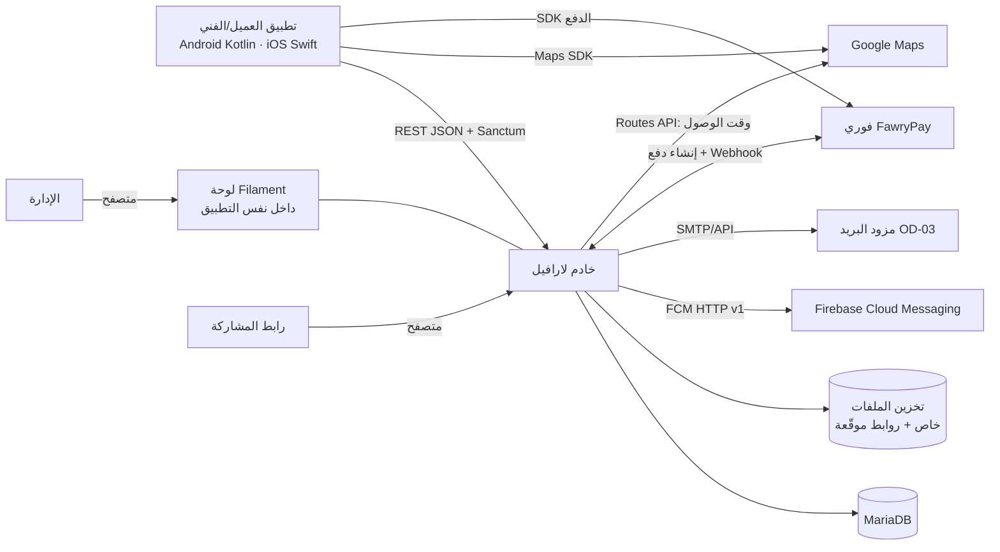

# 30 — معمارية النظام

القرار: **نظام واحد مقسّم إلى وحدات (Modular Monolith)** على لارافيل (DEC-036). لا خدمات مصغرة، لا Event sourcing، لا CQRS، لا Kafka.

## سياق النظام


## المعمارية الداخلية
```mermaid
flowchart TB
  subgraph HTTP
    API[API v1 Controllers] --- ADM[Filament Resources/Actions] --- WH[Webhooks]
  end
  subgraph Application
    ACT[Actions: PublishRequest, AcceptOffer, StartTrip, CompleteWork ...]
    SM[OrderStateMachine — جدول الانتقالات T-xx]
    POL[Policies — الملكية والصلاحيات]
  end
  subgraph Domain Modules
    ID[Identity] --- GEO[Geography] --- CAT[Catalog] --- CUS[Customers] --- PRV[Providers]
    ORD[Orders] --- OFF[Offers] --- PRC[Pricing/Proposals] --- PAY[Payments] --- SET[Settlements]
    COM[Communication] --- REV[Reviews] --- SUP[Support/Disputes] --- NOT[Notifications] --- CFG[Settings]
  end
  subgraph Infrastructure
    Q[Queue workers] --- SCH[Scheduler كل دقيقة] --- ST[Storage] --- FCM[FCM client] --- FAW[Fawry client]
  end
  HTTP --> Application --> Domain Modules --> Infrastructure
```

## هيكل الكود المقترح
```
app/
  Modules/
    Identity/  Geography/  Catalog/  Customers/  Providers/
    Orders/    Offers/     Pricing/  Payments/   Settlements/
    Communication/  Reviews/  Support/  Notifications/  Settings/
      ├── Models/  Actions/  Policies/  Http/Controllers/  Http/Requests/  Http/Resources/
      ├── Events/  Listeners/  Jobs/  Enums/
  Filament/   (Resources مجمعة حسب الوحدة)
```
قواعد الحدود: وحدة تستدعي وحدة أخرى عبر Actions/Services العامة فقط، لا تكتب في جداولها مباشرة. الأحداث الداخلية (Laravel Events) للآثار الجانبية (إشعارات، إحصاءات) — متزامنة داخل المعاملة لما يخص البيانات، وفي الطابور لما يخص الإرسال.

## آلة حالات الطلب
- كلاس `OrderStateMachine` يحوي جدول T-xx: (من، إجراء، منفذ مسموح) ← إلى.
- كل Action: يبدأ معاملة ← `lockForUpdate` على الطلب ← يتحقق من الانتقال والشروط ← يحدّث ← يكتب `order_events` ← يُطلق الأحداث بعد الالتزام (`afterCommit`).
- لا يوجد في أي مكان `$order->status = ...` خارج الآلة (قاعدة مراجعة كود + اختبار).
- مفاتيح وضع التشغيل (CFG-090/091) تُقرأ من `settings` عبر خدمة واحدة بتخزين مؤقت، وتُفحص داخل الآلة نفسها: الإجراء المعطّل يُرفض بـ `FEATURE_DISABLED` قبل أي قفل أو كتابة (39، 31).

## المهام المجدولة (Scheduler كل دقيقة)
| المهمة | القاعدة |
|---|---|
| إنهاء نوافذ العروض والطلبات المنتهية | CFG-010/013، T-03 — وفي وضع الموظفين مهلة التعيين CFG-093 |
| تنبيه الطلبات بلا تعيين (وضع الموظفين) | CFG-092 |
| انتهاء مقترحات السعر | CFG-040، T-15 أو T-28 عند المبلغ صفر |
| تذكيرات/تنبيهات بدء التحرك والتأخر | CFG-031/032 |
| الإغلاق التلقائي | CFG-051، T-21 |
| تنبيه تأخر الدفع | CFG-050 |
| انتهاء محاولات دفع فوري | CFG-052 |
| إخفاء الأرقام، إغلاق نوافذ التقييم، تذكير التقييم | CFG-071، CFG-070 |
| تحديث `dues_blocked_at` وإحصاءات الفنيين | كل 10 دقائق (المنع لا يُطبق في وضع الموظفين — BR-065) |
| حذف الوسائط المؤقتة ونقاط المسار ونقاط الوصول القديمة | يومي |

المهام **idempotent**: كل مهمة تعيد التحقق من الحالة داخل معاملة قبل التنفيذ.

## الطوابير
مشغل Redis (أو `database` في البداية). طوابير: `notifications`، `media`، `default`. إعادة المحاولة 3 مرات مع تأخير متزايد.

## الملفات
- قرص خاص (S3-compatible أو محلي على الخادم) لكل الملفات؛ الوصول بروابط موقّعة مدتها 15 دقيقة بعد فحص الصلاحية.
- الصور: تصغير إلى 1600px + صورة مصغرة. الفيديو والصوت: فحص النوع والمدة والحجم فقط، بلا تحويل.

## التحديث اللحظي
بلا WebSocket في النسخة الأولى:
- Push (FCM) لكل تغيير حالة ورسالة.
- التطبيق يعيد جلب الطلب عند وصول Push وعند العودة للشاشة.
- شاشة التتبع: جلب موقع الفني كل 15 ثانية أثناء "في الطريق".
- المحادثة المفتوحة: جلب كل 5 ثوانٍ.

## البيئات والنشر
- بيئتان: `staging` و`production`. خادم تطبيق (Nginx + PHP-FPM) + MariaDB + Redis + مشغل طوابير (Supervisor) + cron للمجدول.
- phpMyAdmin في بيئة التطوير فقط، أو خلف VPN/IP مسموح في الإنتاج (32).
- نسخ احتياطي يومي لقاعدة البيانات والملفات، واحتفاظ 14 يومًا.

## التطبيقات الأصلية
- Android: Kotlin + Jetpack Compose. iOS: Swift + SwiftUI. (اقتراح؛ ASM-09)
- تطبيق واحد لكل منصة بوضعين. RTL أولًا. الخطوط والألوان والمقاسات من 38.
- Google Maps SDK للخرائط، FCM للإشعارات، SDK فوري للدفع (أو WebView لصفحة الدفع).
