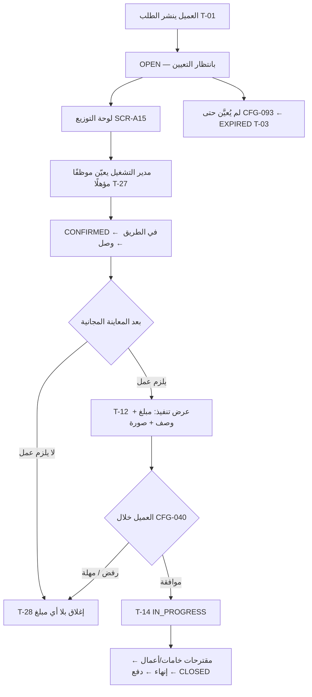

# 39 — وضعا التشغيل (المرجع الرسمي للمرحلة الأولى)

المنصة تعمل في أحد وضعين يحددهما **مفتاحان في الإعدادات**، بلا فرع في الكود ولا جدول مختلف ولا نسخة ثانية من التطبيق:

| المفتاح | الاسم | المرحلة الأولى | المرجع |
|---|---|---|---|
| **CFG-090** | تفعيل عروض السعر (`offers_enabled`) | **معطّل** | DEC-039 |
| **CFG-091** | تفعيل رسوم المعاينة (`inspection_fee_enabled`) | **معطّل** | DEC-040 |

- `CFG-090 = false` ← **وضع الموظفين**: مقدمو الخدمة موظفون لدى المنصة، ولا عروض، والتعيين يدوي من مدير التشغيل.
- `CFG-090 = true` ← **وضع السوق**: النموذج الكامل الموصوف في باقي الوثائق (عروض، مقارنة، اختيار).
- `CFG-091` لا يُفعَّل إلا مع `CFG-090`، لأن رسوم المعاينة تأتي من عرض مقدم الخدمة المستقل (BR-009).

كل ما تصفه الوثائق من 01 إلى 38 هو **وضع السوق**. هذه الوثيقة تصف ما يختلف في وضع الموظفين فقط؛ ما لم يُذكر هنا فهو واحد في الوضعين.

## لماذا
في البداية لا يوجد عدد كافٍ من مقدمي الخدمة لتقوم منافسة حقيقية على السعر، والمنفذون موظفون بأجر لا شركاء. فالعرض بلا منافسة يعطي العميل انطباعًا زائفًا، والمعاينة برسوم تمنع أول تجربة. عند دخول مقدمي خدمة مستقلين (ليسوا موظفين) يُفعَّل المفتاحان فيضيفون عروضهم ورسوم معاينتهم بأنفسهم (DEC-039، DEC-040).

## الفروق بين الوضعين
| البند | وضع الموظفين (CFG-090 معطّل) | وضع السوق (CFG-090 مفعّل) |
|---|---|---|
| وصول الطلب لمقدم الخدمة | تعيين يدوي من مدير التشغيل (T-27) | بث لكل مؤهل + عروض (08، 09) |
| النافذة الزمنية | مهلة تعيين (CFG-092 تنبيه، CFG-093 انتهاء) | `offers_close_at` + `selection_deadline_at` (CFG-010/013) |
| اختيار العميل | لا يوجد؛ الطلب يُعيَّن | يقارن ويختار (SCR-C06/C07/C08) |
| طريقة التسعير | كل الطلبات `INSPECTION` والحقل مخفي (BR-008) | العميل يختار تنفيذ/معاينة (BR-017) |
| رسوم المعاينة | **صفر** (CFG-091 معطّل) | من عرض مقدم الخدمة + خصمها اختياري (BR-032) |
| سعر المصنعية | عرض تنفيذ من الموقع بعد المعاينة (BR-042) | سعر العرض المقبول، أو عرض تنفيذ في طلب المعاينة |
| رفض عرض التنفيذ | إغلاق بلا أي مبلغ (T-28) | دفع رسوم المعاينة (T-15) |
| المحادثة قبل التأكيد | لا توجد (لا عروض) | العميل يبدأ مع مقدم عرض (BR-100) |
| العمولة | 100% من المصنعية للمنصة (BR-065) | نسبة CFG-062 (BR-060) |
| المستحقات | الموظف يورّد المحصَّل نقدًا يوميًا (CFG-094) | رصيد محسوب + تحويل أسبوعي (BR-062، BR-064) |
| المنع بسبب الدين (BR-063) | لا يُطبق (لا عروض تُمنع) | يُطبق |
| صفة مقدم الخدمة | `employment_type = EMPLOYEE` | `INDEPENDENT` |

## مسار الطلب في وضع الموظفين

## القواعد الحاكمة
BR-006 (الوضعان)، BR-007 (التعيين)، BR-008 (المعاينة المجانية)، BR-009 (تثبيت الوضع على الطلب وقيد المفتاحين)، BR-056 (إغلاق بمبلغ صفر)، BR-065 (العمولة والتوريد في وضع الموظفين).

## سجل التعيين = عرض
لا يوجد كيان جديد. التعيين يُنشئ صف `offers` بحالة `ACCEPTED` وسعر `0.00` و`source = ADMIN_ASSIGNMENT`، فيبقى `orders.accepted_offer_id` وكل ما بُني عليه (السجل، الصلاحيات، الكشوف، النزاعات) كما هو في الوضعين. لا يرى العميل ولا مقدم الخدمة هذا الصف كعرض.

## ما يظهر ويختفي في الواجهات
| الطرف | يختفي في وضع الموظفين | يظهر بدلًا منه |
|---|---|---|
| العميل | SCR-C06 العروض، SCR-C08 تأكيد الاختيار، حقل "طريقة التسعير" في SCR-C04، الميزانية المتوقعة | SCR-C36 "جارٍ تعيين فني لطلبك" |
| مقدم الخدمة | SCR-P09 تفاصيل طلب متاح، SCR-P10 تقديم عرض، SCR-P11 عروضي، "متاح الآن" اختياري | كارت "طلب معيَّن لك" في SCR-P08 |
| مقدم الخدمة | "صافي لك" بعد العمولة، الرصيد المتاح للتحويل في SCR-P18 | "المطلوب توريده" (BR-065) |
| الإدارة | قائمة "بدون عروض" | SCR-A15 لوحة التوزيع والتعيين |

التطبيقات تقرأ المفتاحين من `GET /config` عند الإقلاع وتخفي ما يلزم؛ الخادم يرفض أي إجراء يخص ميزة معطّلة بـ `FEATURE_DISABLED` ولا يعتمد على إخفاء الواجهة.

## التبديل إلى وضع السوق
1. اعتماد قيمة CFG-062 (نسبة العمولة) وCFG-061 (حد الدين) — OD-01، OD-02.
2. تحويل ملفات الموظفين إلى `INDEPENDENT` أو إبقاؤهم موظفين جنبًا إلى جنب (الوضع على مستوى المنصة، والصفة على مستوى الملف).
3. تفعيل CFG-090 ← الطلبات **الجديدة** فقط تنشر بعروض؛ الطلبات القائمة تكمل بوضعها المثبت (BR-009).
4. تفعيل CFG-091 عند الرغبة في رسوم معاينة.
5. لا ترحيل بيانات ولا تغيير مخطط ولا إصدار تطبيق جديد.

## ما لا يتغير بين الوضعين
إنشاء الطلب وخطواته ووسائطه، الأهلية (BR-022 بنودها 1–3 و5 و6)، التتبع، المعاينة كمسار، مقترحات السعر، الدفع، الإنهاء والتأكيد، التقييم المتبادل، النزاعات والبلاغات، الإشعارات التشغيلية بعد التأكيد، الصلاحيات، سجل الأحداث، ومخطط قاعدة البيانات.
