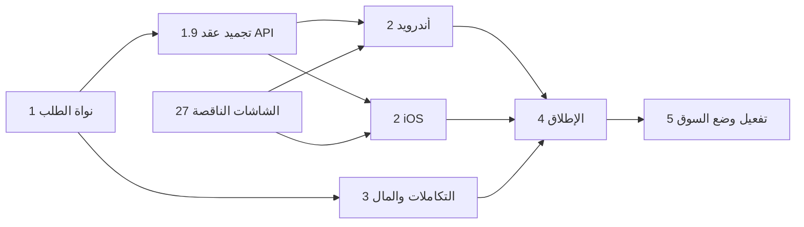

# 41 — خطة الاستكمال (المرجع الرسمي للتنفيذ)

هذه الوثيقة تجيب على سؤال واحد: **ما التالي، ومن يعمله، ومتى يُعتبر منجزًا.**
لا تحمل أي قرار منتج جديد؛ كل قرار يُسجَّل في 34 قبل أن يظهر هنا.

## قاعدة العمل الملزمة: الوثيقة أولًا
| الحالة | الإجراء الصحيح | الإجراء الخاطئ |
|---|---|---|
| سلوك جديد | عدّل الوثيقة المرجعية ← ثم اكتب الكود | كود ثم "نوثّقه بعدين" |
| قرار مالك جديد | `DEC-xxx` في 34 ← ثم التنفيذ | قرار داخل كود أو اجتماع |
| معرّف جديد (BR/CFG/EVT/NTF/EC/T/SCR/AC) | يُعرَّف في وثيقته المرجعية أولًا | معرّف يظهر في الكود بلا تعريف |
| انحراف اضطراري في التنفيذ | عدّل الوثيقة في نفس الـ PR | تعليق `// TODO يخالف الوثيقة` |

**تعريف "منجز" (DoD) لأي بند في هذه الخطة:**
1. الكود يعمل ومغطى باختبار.
2. الوثيقة المرجعية محدّثة (والمعرّفات مسجّلة).
3. معيار قبول في 33 يغطي السلوك.
4. سطر الحالة في §سجل التقدم أدناه محدّث.

## المسارات
| الرمز | المسار | المخرج |
|---|---|---|
| **BE** | الخادم | Actions، API v1، تكاملات، مهام مجدولة، صلاحيات |
| **ADM** | لوحة الإدارة (Filament) | باقي وحدات 16 والتدخلات |
| **AND** | تطبيق أندرويد `androidapp/` | Kotlin + XML Views (DEC-047، ASM-09) |
| **IOS** | تطبيق iOS `iosapp/` | Swift + SwiftUI (ASM-09) |
| **DES** | التصميم | الشاشات الناقصة في 27 |
| **OPS** | التشغيل | بيئتان، نشر، مراقبة، نسخ احتياطي (30) |

## المراحل والبوابات

### المرحلة 0 — الأساس ✅ منجزة
المخطط الكامل، الـ enums، آلة الحالات بجدول T-01..T-29، بوابة مفاتيح المرحلة، التعيين وإعادة التعيين، إنهاء المعاينة المجانية، حساب المبالغ، لوحة إدارة أولية بنظام تصميم 38. التفاصيل: 40.

### المرحلة 1 — نواة الطلب وعقد API (BE) 🔴 الحالية
**البوابة التي تفتح مساري التطبيقات.** لا يبدأ AND ولا IOS قبل تجميد عقد API.

| # | البند | المرجع | الوثيقة التي تتحدث |
|---|---|---|---|
| 1.1 ✅ | `PublishRequestAction` (T-01): التحقق، المهلات حسب الوضع، رقم الطلب، EVT-001 | 07، BR-013..BR-021 | 33 (AC-REQ) |
| 1.2 ✅ | إجراءات الزيارة: بدء التحرك، الوصول، بدء التنفيذ (T-05، T-10، T-11) | 10، BR-110، BR-111 | 33 (AC-EXE) |
| 1.3 ✅ | مقترحات السعر: تقديم، موافقة، رفض، مهلة، سحب (T-12..T-15، T-17) | 12، BR-040..BR-045 | 33 (AC-PRC) |
| 1.4 ✅ | الإلغاء والاعتذار (T-04، T-06، T-08، T-16، T-18، T-26) | 13 | 33 (AC-CAN) |
| 1.5 ✅ | الدفع والإنهاء (T-19..T-21، T-25) | 19، 14 | 33 (AC-PAY) |
| 1.6 ✅ | النزاعات (T-22..T-24) | 16 §قرار النزاع | 33 (AC-DSP) |
| 1.7 ✅ | العروض (O-01..O-07) — مبنية ومعطّلة بـ CFG-090 | 09 | 33 (AC-OFR) |
| 1.8 ✅ | سياسات الملكية والصلاحيات | 23 | 23 |
| 1.9 ✅ | **عقد API v1 + ملف OpenAPI مولَّد ومُختبَر** | 31 | 31 |
| 1.10 ✅ | المهام المجدولة (المهلات والتنبيهات) | 30 §المهام المجدولة | 30 |

**بوابة الخروج:** كل انتقال في 10 له Action مُختبَر، وملف OpenAPI يمر على مُحقِّق، ومعايير 33 خضراء.

> ✅ **اجتيزت.** العقد في `docs/api/openapi.json` مولَّد من المسارات، ويحرسه `ApiContractTest`:
> لا مسار يعدّل الحالة مباشرة، كل مسارات الكتابة محمية، والعقد يعلن إجراءات آلة الحالات ورموز الأخطاء كما هي.
> المتبقي من الواجهات (الوسائط، المحادثة، الدفع الإلكتروني، الإشعارات) يضاف في المرحلة 3 بلا كسر العقد.

### المرحلة 2 — التطبيقان (AND + IOS) بالتوازي
تبدأ فور اجتياز بوابة المرحلة 1. المعمارية والقواعد المشتركة: **42-MOBILE-ARCHITECTURE**.

وفق DEC-045، «بالتوازي» تعني أن كل تعديل واجهة يدخل Android وiOS في الدفعة نفسها. يُبنى `iosapp/Core` وتُفحص كل مصادر Swift على Linux أثناء كل دفعة؛ تشغيل Xcode واللقطات والمقارنة البصرية لـ iOS مرحلة تحقق أخيرة مستقلة، وليس بوابة يومية.

| # | البند | المرجع |
|---|---|---|
| 2.1 | الهيكل والتبعيات وطبقة الشبكة ومعالجة أخطاء 31 | 42 |
| 2.2 ✅ | نظام التصميم: توكنات 38 كملفات مولَّدة، RTL، الخط | 38، 42، DEC-043 |
| 2.3 | الدخول والتسجيل وتفعيل البريد (SCR-C10..C13) | 15، DEC-025 |
| 2.4 | إنشاء الطلب 3 خطوات + الوسائط + العناوين (C03..C05، C14..C17) | 07، 20 |
| 2.5 | حالة انتظار التعيين (C36) وشاشات العروض (C06..C08) خلف مفتاح `offers_enabled` | 39 |
| 2.6 | التتبع والخريطة ومشاركة الزيارة (C09، W01) | DEC-030، DEC-037 |
| 2.7 | الموافقة على عرض التنفيذ والمقترحات (C30، C31) | 11، 12 |
| 2.8 | الدفع والتأكيد والتقييم (C21..C24) | 19، 14 |
| 2.9 | وضع الفني كاملًا (P01..P21) | 06، 15 |
| 2.10 | الإشعارات والروابط العميقة | 17 |

### المرحلة 3 — التكاملات والمال (BE + ADM)
فوري (إنشاء دفع + Webhook + استرداد)، FCM، كشوف المستحقات والتوريد، والنزاعات والبلاغات والتقييمات في اللوحة. تكامل Google Routes لوقت الوصول أُنجز ضمن استكمال الدفعة 2 وفق CFG-081.

### المرحلة 4 — تجهيز الإطلاق (OPS + المالك)
حسم OD-03، OD-04، OD-05، OD-10، OD-11، OD-12. بيئتا staging وproduction، نسخ احتياطي واحتفاظ 14 يومًا، مراقبة، مراجعة أمنية مقابل 32.

### المرحلة 5 — تفعيل وضع السوق
**بلا كود ولا إصدار تطبيق.** حسم OD-01 وOD-02 ← تفعيل CFG-090 ← اختياريًا CFG-091. التفاصيل: 39 §التبديل.

## خطة الدفعات بعد 4د (DEC-054) — المرجع الحالي
الهدف منتج متكامل: كل نطاق 02 يعمل فعليًا بلا محاكاة. ما يعتمد على بيانات أو حساب من المالك يُكتب **عائقًا** في التقرير ولا يُحاكى. iOS يُكتب بالتوازي، وتشغيله على macOS آخر دفعة (DEC-045).

### أولًا (بالترتيب)
| # | الدفعة | المحتوى | البوابة |
|---|---|---|---|
| أ | تقرير 4ج و4د | `reports/batch-4c/REPORT.md`، `reports/batch-4d/REPORT.md` | اعتماد لقطات Compose (تصبح هدف المقارنة) |
| ب | **تحويل أندرويد إلى XML** (DEC-047، 43 §13) | 1. التوليد والأنماط ← 2. المكونات الـ 42 والمعرض ← **بوابة** ← 3. الشاشات 3أ، 3ب، 3ج، 4أ..4د ← 4. حذف Compose | مقارنة كل لقطة XML بالمعتمدة؛ المطابق يُقفل والمختلف يرجع للمالك |
| ب′ | بالتوازي مع (ب): الجزء الخادمي من DEC-048..053 | الهوية والدومين، ZeptoMail، قناة `INSTAPAY_MANUAL`، وحدة «الصفحات»، دمياط الجديدة، الكتالوج | اختبارات الخادم |
| ج | بعد إغلاق التحويل: شاشات DEC-048..053 في المنصتين | C01، C03، C08، C21، C22، C34 | بوابة اعتماد |

### ثم بالترتيب، ولكل دفعة بوابة وتقرير
| # | الدفعة | المحتوى |
|---|---|---|
| 5 | تطبيق الفني P01–P21 بـ XML | 5أ P01–P07 · 5ب P08–P11 · 5ج P12–P16 + P20–P21 · 5د P17–P19. **لا تبدأ قبل رد المالك على OD-11/OD-12** |
| 6 | الإشعارات | FCM لأندرويد، كود APNs لـ iOS، الإشعارات الداخلية، البريد عبر ZeptoMail، فتح الشاشة المرتبطة، إعادة المحاولة (EC-22) |
| 7 | المال | المستحقات وكشف الفني، منع العروض (BR-063)، تسجيل التحويلات والسداد عبر إنستاباي، الاسترداد، وربط فوري الحقيقي فور وصول بيانات الحساب (وإلا عائق في التقرير) |
| 8 | لوحة الإدارة كاملة | حسب 16 و23، بمصادقة ثنائية إلزامية (ASM-14)، واختبارات لكل دور |
| 9 | التجهيز للإنتاج | مراجعة أمنية مقابل 32، حدود المعدل، مهام الاحتفاظ، النسخ الاحتياطي وتجربة الاسترجاع، مراقبة الأخطاء، قياس أداء التوزيع، توقيع release، إعدادات البيئات |
| 10 | الاختبار الشامل | كل معايير 33 من أولها لآخرها على staging، بتقرير لكل AC |
| 11 | النشر والمتاجر | تنفيذ 44 على الإنتاج، صفحات Google Play وApp Store، نموذج أمان البيانات، روابط الشروط والخصوصية |
| 12 | تحقق iOS على macOS | البناء، اللقطات مقابل مراجع أندرويد، MapKit، الوسائط، APNs، TestFlight |

القواعد ثابتة: المواصفة أولًا، المنصتان معًا، المنطق في الطبقة المشتركة، حالات اختبار مشتركة، الأزرار من `available_actions` فقط.

## الاعتماديات الحرجة

- **التصميم على المسار الحرج**: وضع الفني كله ناقص (27 §ج). يبدأ الآن بالتوازي مع المرحلة 1.
- **حساب فوري التجاري** (OD-10) يستغرق وقتًا؛ يبدأ الآن لا في المرحلة 3.

## سجل التقدم
| المرحلة | الحالة | ملاحظة |
|---|---|---|
| 0 الأساس | ✅ منجزة | 40 |
| 1 نواة الطلب وعقد API | ✅ **البوابة مفتوحة** | كل بنود المرحلة منجزة (78 اختبارًا، 452 تأكيدًا). العقد مولَّد ومحروس: `docs/api/openapi.json` |
| 2 التطبيقان | 🟡 **تحويل أندرويد إلى XML (DEC-047) — عند بوابة اعتماد** | 4ج و4د: تقريرا الاعتماد مكتوبان. الخطوتان 1 و2 منجزتان: الموارد مولّدة، 42 مكوّنًا XML، المعرض 16/16 مطابق لأهداف Compose (`reports/xml-conversion/REPORT.md`). الخطوة 3 (الشاشات) بعد الاعتماد |
| ب′ الخادم لـ DEC-048..053 | ✅ منجز | الهوية، ZeptoMail + W02، إنستاباي بتأكيد الإدارة، الصفحات القانونية، دمياط الجديدة، الكتالوج (166 اختبارًا). التقرير: `reports/server-dec-048-053/REPORT.md` |
| 3 التكاملات والمال | ⏸ | OD-10 يبدأ مبكرًا |
| 4 الإطلاق | ⏸ | يعتمد على OD-03..05، OD-10..12 |
| 5 وضع السوق | ⏸ | مفتاح إعداد فقط |
