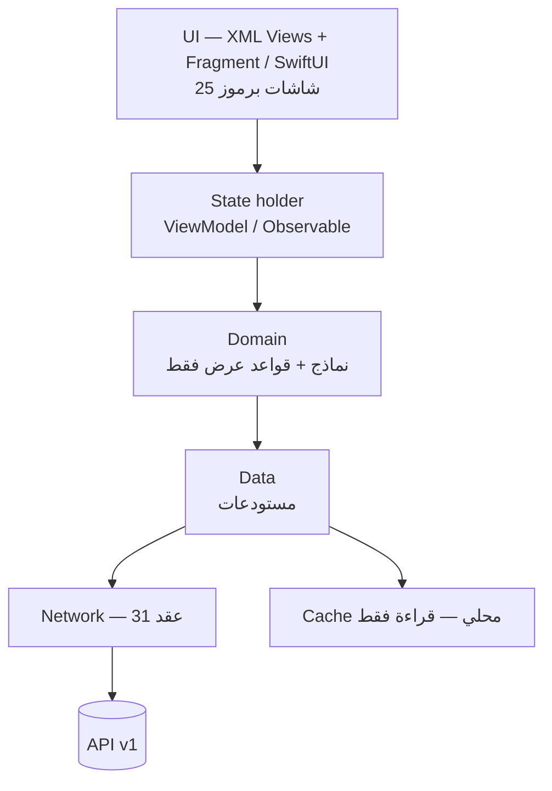

# 42 — معمارية التطبيقات الأصلية (المرجع الرسمي لمساري AND وIOS)

تطبيق واحد لكل منصة بوضعين — عميل وفني (DEC-001، 03). المنصتان تتبعان **نفس** التقسيم والتسميات والعقود؛ ما يختلف هو اللغة والأدوات فقط.

```
androidapp/   Kotlin + XML Views + Fragments       (DEC-047، ASM-09)
iosapp/       Swift + SwiftUI                     (ASM-09)
design/tokens.json  المصدر الواحد لتوكنات 38 (DEC-043، 43 §2)
```

وفق DEC-045، كود المنصتين يتغير في الدفعة نفسها. `iosapp/Core` حزمة Swift مستقلة عن SwiftUI/UIKit تُبنى وتُختبر على Linux؛ تشغيل Xcode وSimulator والتحقق البصري مؤجل إلى دفعة «تحقق iOS» النهائية فقط.

## 1. المبادئ الخمسة

**١. الخادم يقرر، التطبيق يعرض.**
الانتقالات المسموحة تأتي من الخادم (10)؛ التطبيق لا يستنتج حالة ولا يخفي زرًا بناءً على منطق محلي مكرر. الواجهة تعطّل الزر للعرض، والخادم هو من يرفض.

**٢. الوضعان مدعومان من أول إصدار (DEC-041).**
`GET /config` عند الإقلاع وعند العودة للمقدمة يعطي `offers_enabled` و`inspection_fee_enabled`. الشاشات المرتبطة بالعروض ورسوم المعاينة تُبنى كاملة وتُخفى بالمفتاح. **ممنوع** ربط ظهورها بثابت في الكود أو بنكهة بناء (build flavor)، لأن تفعيل CFG-090 عندها يحتاج إصدارًا ومراجعة متجر — وهذا يناقض 39.

**٣. لا طابور إجراءات دون اتصال (DEC-042).**
القراءة تُخزَّن مؤقتًا (الطلبات، الكتالوج، العناوين). الكتابة تتطلب اتصالًا. عند الانقطاع: رسالة واضحة وإعادة محاولة يدوية، لا إرسال صامت لاحقًا.

**٤. التوكنات مولَّدة لا منسوخة (DEC-043).**
الألوان والمقاسات والاستدارات من `design/tokens.json` ← `tools/gen-design` ← ملفات مولَّدة لكل منصة. قيمة لون مكتوبة يدويًا في شاشة = خطأ مراجعة.

**٥. كل شاشة لها رمز من 25.**
اسم الملف يحمل الرمز: `C09TrackingScreen.kt` / `C09TrackingView.swift`. شاشة بلا رمز في 25 = شاشة غير موثّقة، تُرفض في المراجعة.

## 2. الطبقات (متطابقة في المنصتين)

- **Domain في التطبيق لا يكرر قواعد 04.** يحمل نماذج العرض ومشتقات بسيطة (تنسيق مبلغ، عدّاد مهلة). أي قاعدة عمل تبقى على الخادم.
- **الوحدات** تطابق وحدات الخادم: `identity, catalog, geography, addresses, orders, offers, pricing, payments, communication, reviews, support, notifications, settings`.

## 3. طبقة الشبكة — عقد 31
| البند | القاعدة |
|---|---|
| المصادقة | `Authorization: Bearer <sanctum>`؛ التوكن في تخزين مشفّر (Keystore / Keychain) لا في تفضيلات عادية |
| الوضع | `X-App-Mode: CUSTOMER \| PROVIDER` مع كل طلب |
| عدم التكرار | كل POST يحمل `Idempotency-Key` (UUID) يُولَّد مرة لكل محاولة مستخدم، ويُعاد استخدامه عند إعادة المحاولة |
| التزامن | إرسال `expected_version` للطلب؛ `409 CONFLICT` ← إعادة جلب الطلب وعرض الحالة الجديدة |
| الأخطاء | جدول 31: لكل رمز رسالة عربية ثابتة في مورد نصوص مشترك |
| `FEATURE_DISABLED` | لا يُعرض كخطأ للمستخدم: يعني أن الواجهة متأخرة عن الإعداد ← إعادة قراءة `GET /config` وتحديث الشاشة |
| `EMAIL_NOT_VERIFIED` | يفتح شاشة التفعيل (C12) مباشرة |
| `ACCOUNT_BLOCKED` | خروج فوري ورسالة (BR-003) |
| حدود المعدل | `429` ← تراجع أُسّي مع حد أقصى، وبلا إعادة محاولة تلقائية لإجراءات الكتابة |

## 4. التحديث اللحظي (بلا WebSocket — 30)
- Push (FCM) لكل تغيير حالة ورسالة → التطبيق يعيد جلب الطلب.
- عند العودة إلى المقدمة: إعادة جلب الطلب النشط و`GET /config`.
- شاشة التتبع: جلب موقع الفني كل 30 ثانية أثناء `ON_THE_WAY` فقط.
- المحادثة المفتوحة: جلب كل 5 ثوانٍ.
- عدّادات المهل (نافذة العروض، مهلة المقترح CFG-040) تُحسب من `expires_at` القادم من الخادم، لا من ساعة الجهاز وحدها.

## 5. الموقع والخرائط
| البند | القاعدة |
|---|---|
| إرسال موقع الفني | كل CFG-080 في `ON_THE_WAY` **فقط**؛ يتوقف فورًا عند `ARRIVED` (BR-110) |
| إذن الموقع | مطلوب لبدء التحرك؛ رفضه يمنع T-05 مع رسالة (EC-21) |
| تحديد موقع العميل | يدوي على الخريطة إن رُفض الإذن (EC-21) |
| الخصوصية | لا يرى الموقع الحي إلا العميل صاحب الطلب (DEC-030)؛ صفحة المشاركة بلا موقع حي (DEC-037) |
| وقت الوصول | يأتي محسوبًا من الخادم؛ التطبيق يعرضه ولا يحسبه |

## 6. الإشعارات والروابط العميقة
كل `NTF-xx` في 17 له وجهة محددة داخل التطبيق. الإشعار الداخلي محفوظ على الخادم، ففشل Push لا يفقد الحدث (EC-22). NTF-25 لا يحمل نص الرسالة أبدًا (DEC-058).

| البند | Android | iOS |
|---|---|---|
| الاستقبال | `FirebaseMessagingService`؛ عرض الإشعار بالقنوات `orders` و`messages` و`account` | `UNUserNotificationCenter` + Firebase Messaging (رمز APNs يُسلَّم لـFirebase) |
| الإذن | `POST_NOTIFICATIONS` (13+) مرة واحدة بعد أول C01/P08 | `requestAuthorization` في اللحظة نفسها |
| الرمز | `POST /me/devices` بعد الدخول، وعند `onNewToken`، و`DELETE` عند الخروج | نفس الشيء عند `didReceiveRegistrationToken` |
| الفتح | `PendingIntent` يحمل `deep_link` إلى النشاط الرئيسي، وintent-filter لـ`bremo://` و`https://{APP_DOMAIN}/app/*` | `userNotificationCenter(didReceive:)` و`onOpenURL` وUniversal Links |
| التوجيه | `DeepLinkRouter` في المنطق المشترك: يحوّل الرابط إلى الوضع والشاشة والمعرّف، ويُختبر بـ`design/fixtures/deeplinks/cases.json` في المنصتين | نفس المنطق في `BzrCore` بنفس الـfixture |

التطبيق لا يبني رابطًا من الرمز. الرابط غير المعروف يفتح C32. الرابط الذي يحتاج وضع الفني ينقل التطبيق إليه إن كان للمستخدم ملف فني؛ وبدونه يفتح C32 للعميل. الرابط الوارد قبل الدخول يُحفظ ويُفتح بعد الدخول.

## 7. الدفع
الدفع الإلكتروني بعد الإنهاء فقط (BR-051). SDK فوري أو WebView لصفحة الدفع، وكود فوري يُعرض مع صلاحيته (CFG-052). **التطبيق لا يغيّر حالة الطلب بعد الدفع**؛ الإغلاق يأتي من webhook الخادم (T-20) والتطبيق يعيد الجلب.

## 8. الهوية البصرية
- الألوان والمقاسات والاستدارات: مولَّدة من 38 (DEC-043).
- RTL هو الأصل؛ كل تخطيط يُختبر بالعربية أولًا.
- الأرقام عربية غربية (38 §2).
- النصوص بالصيغة المحايدة من قاموس 38 §8، ونصوص وضع الموظفين من 38 §نصوص وضع الموظفين.
- الخط: عائلة عربية هندسية (OD-07) بأوزان 400/500/600/700.

## 9. الأمان (32)
التوكن في تخزين مشفّر · لا تسجيل بيانات شخصية في السجلات · إخفاء محتوى الشاشة في مبدّل التطبيقات للشاشات التي تعرض عنوانًا أو هاتفًا · التحقق من الشهادة · لا لقطة شاشة تلقائية لمستندات الهوية · مسح التوكن عند الحظر أو تسجيل الخروج.

## 10. الاختبار
| المستوى | المحتوى |
|---|---|
| وحدة | تحويل نماذج، تنسيق المبالغ والتواريخ، منطق العدّادات |
| عقد | أمثلة 31 المسجّلة كاستجابات ثابتة؛ كسر العقد يكسر البناء |
| واجهة | لكل شاشة في 25: الحالة الفارغة، التحميل، الخطأ، الوضعان |
| طرفي | مسار المرحلة الأولى كاملًا: نشر ← انتظار تعيين ← تتبع ← معاينة مجانية ← عرض تنفيذ ← دفع ← تقييم |

## 11. androidapp — التفاصيل
| البند | الاختيار |
|---|---|
| اللغة والواجهة | Kotlin · XML Views · Fragments + Navigation Component (`nav_graph.xml`) · ViewBinding · Material Components بأنماط `Widget.Bremo.*` المولّدة من توكنات 38 (DEC-047) |
| القوائم | RecyclerView + ListAdapter + DiffUtil |
| الحالة في الواجهة | الـ Fragment يجمع `StateFlow` من الـ ViewModel بـ `repeatOnLifecycle(STARTED)` ويعرض فقط؛ لا منطق في الـ Fragment |
| الحقن | Hilt |
| الشبكة | Retrofit + OkHttp + kotlinx.serialization؛ Interceptor للتوكن و`X-App-Mode` و`Idempotency-Key` |
| الحالة | ViewModel + StateFlow؛ `collectAsStateWithLifecycle` |
| التخزين | DataStore للتفضيلات · EncryptedSharedPreferences/Keystore للتوكن · Room للقراءة المخزّنة عند الحاجة |
| الصور | Coil |
| الخرائط | Maps SDK for Android |
| الإشعارات | FCM |
| البنية | وحدة `:app` + وحدات مجال (`:feature:orders` …) + `:core:network` `:core:design` |
| التوزيع | Play Console — قناة داخلية ثم إنتاج |

## 12. iosapp — التفاصيل
| البند | الاختيار |
|---|---|
| اللغة والواجهة | Swift · SwiftUI |
| الحالة | `@Observable` + `async/await` |
| الشبكة | URLSession + Codable؛ طبقة اعتراض للتوكن والترويسات |
| التخزين | Keychain للتوكن · `UserDefaults` للتفضيلات · SwiftData للقراءة المخزّنة عند الحاجة |
| الخرائط | MapKit؛ نفس إحداثيات وحالة العرض المتفق عليها مع Android، مع السماح باختلاف عنصر النظام وفق 43 §7 |
| الإشعارات | APNs عبر FCM |
| البنية | حزم محلية (Swift Package) لكل وحدة مجال + `DesignSystem` + `Networking` |
| نواة Linux | `iosapp/Core`: الموديلات وAPI client وCodable والتنسيق وربط `available_actions` ومفاتيح النص، بلا SwiftUI/UIKit |
| RTL | `environment(\.layoutDirection, .rightToLeft)` واختبار كل شاشة بالعربية |
| التوزيع | TestFlight ثم App Store |

## 13. ترتيب البناء داخل كل تطبيق
1. الهيكل والتبعيات + `Networking` + `DesignSystem` المولَّد.
2. `GET /config` والتحكم بالمفاتيح (DEC-041) — **قبل** أي شاشة مرتبطة بالعروض.
3. الدخول والتسجيل (C10–C13).
4. الرئيسية والعناوين وإنشاء الطلب (C01، C14–C17، C03–C05).
5. انتظار التعيين (C36) والتتبع (C09).
6. عرض التنفيذ والمقترحات (C30، C31).
7. الدفع والتأكيد والتقييم (C21–C24).
8. وضع الفني (P01–P21).
9. شاشات العروض (C06–C08، P09–P11) — تُبنى وتبقى خلف المفتاح.

في كل خطوة: ملف layout والكلاس في أندرويد وملف SwiftUI والـ fixtures ومفاتيح النص ومدخلات المكونات تُسجّل في `design/parity.json`. لا تُغلق خطوة فيها جهة واحدة فقط. Linux يشغّل `swift build` و`swift test` وswift-format وSwiftLint؛ لقطة iOS تُغلق نهائيًا في الدفعة 8 من 43 §11.
